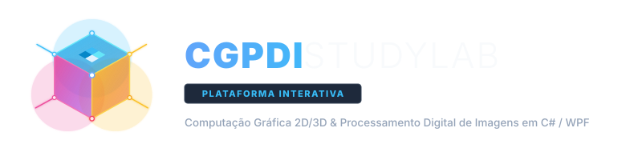
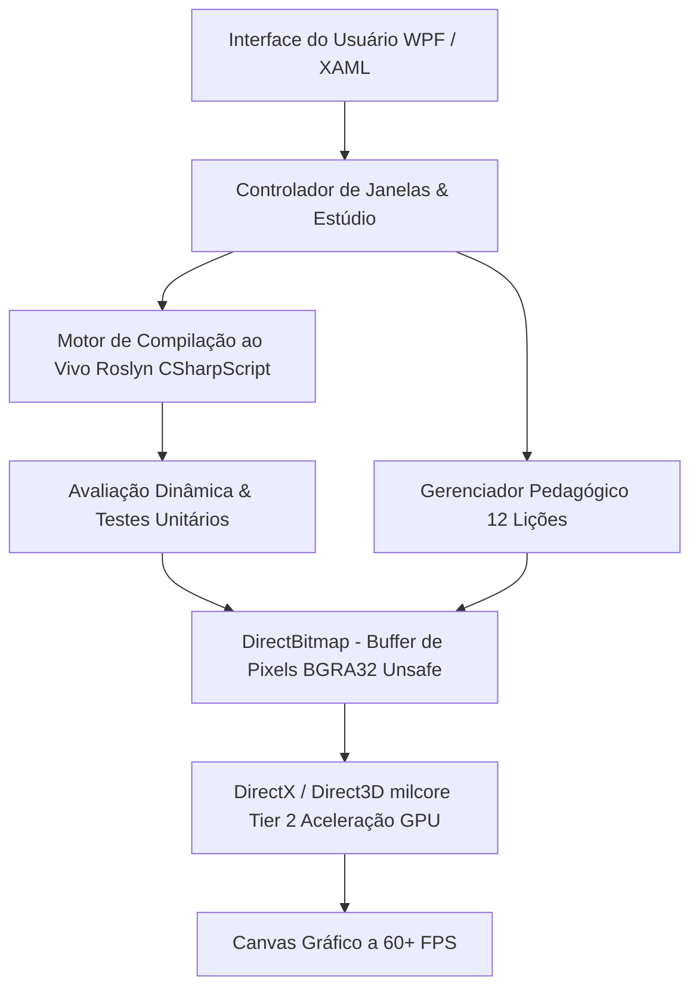

# 🎓 CGPDI StudyLab

<div align="center">
  
  <p><strong>Plataforma Educacional Interativa para Computação Gráfica 2D/3D & Processamento Digital de Imagens em .NET 10, C# e WPF com Aceleração por Hardware GPU</strong></p>
</div>

---

## 🌟 Visão Geral

O **CGPDI StudyLab** é um ambiente de aprendizado imersivo projetado para que estudantes, professores e engenheiros de software dominem os conceitos fundamentais e avançados de **Computação Gráfica** e **Processamento Digital de Imagens**. 

Diferente de ferramentas estáticas, o StudyLab integra um **compilador Roslyn C# em tempo real** diretamente ao pipeline de renderização gráfica (`DirectBitmap`). Isso significa que **qualquer alteração no código C# — seja trocar canais de cor, alterar matrizes ou modificar equações de iluminação — atualiza imediatamente o Canvas visual e a memória RAM!**

---

## 🎨 Identidade Visual & Assets SVG

Os arquivos vetoriais oficiais do projeto estão localizados em `CGPDI.StudyLab/Assets/`:
- **`logo.svg`**: Ícone vetorial do cubo 3D isométrico com canais RGB, matriz de pixels e feixes de ray tracing.
- **`logo_full.svg`**: Banner institucional completo com tipografia e identidade visual em alta definição.
- **`app_icon.ico`**: Ícone oficial multi-resolução para o executável Windows (`.exe`), barra de tarefas e título de janelas.

---

## 📸 Interface

> Screenshots e GIF atualizados automaticamente via GitHub Actions a cada push.

<div align="center">
  
</div>

<details>
<summary><b>🖼️ Ver screenshots de cada módulo</b></summary>

| Laboratório PDI | Computação Gráfica 2D |
|:-:|:-:|
|  |  |

| Computação Gráfica 3D | Ray Tracing |
|:-:|:-:|
|  |  |

| Central de Estudos | Laboratório de Código |
|:-:|:-:|
|  |  |

| Estúdio de Projetos | |
|:-:|:-:|
|  | |

</details>

---

## 🏗️ Arquitetura do Software



---

## 🚀 Trilha de Aprendizado Completa (12 Lições Interativas)

### 🔵 Módulo 1: Fundamentos de C# para Gráficos
1. **Tipos Primitivos & Formato BGRA32 na Memória RAM**:
   - Manipulação de canais de cor de 8 bits (`byte`) e empacotamento em inteiros de 32 bits (`uint`) com operadores bitwise `|` e `<<`.
2. **Data Binding Reativo & `INotifyPropertyChanged`**:
   - Padrão MVVM com sincronização de propriedades C# diretamente na interface gráfica XAML sem acoplamento.
3. **Ponteiros Não Gerenciados (`unsafe byte*`) & Stride**:
   - Endereçamento de memória linear em buffers de imagem 2D: $\text{Offset} = (Y \times \text{Stride}) + (X \times 4)$.

### 🟢 Módulo 2: O Pipeline WPF & Manipulação Direta
4. **Dependency Properties & Ciclo de Layout (`MeasureOverride` / `ArrangeOverride`)**:
   - Como a árvore visual do WPF calcula o tamanho desejado e organiza os elementos na tela.
5. **Ciclo de Vida do `WriteableBitmap` & BackBuffer da GPU**:
   - Sequência de alto desempenho: $\text{Lock()} \to \text{Escrita de Pixels} \to \text{AddDirtyRect()} \to \text{Unlock()}$.

### 🟡 Módulo 3: Processamento Digital de Imagens (PDI)
6. **Convolução Espacial 2D & Filtro Box Blur 3x3**:
   - Aplicação de máscaras de convolução e filtros espaciais sobre matrizes de vizinhança $3 \times 3$.
7. **Limiarização Automática pelo Critério de Otsu**:
   - Algoritmo estatístico que maximiza a variância inter-classes ($\sigma^2_B$) em complexidade $O(256)$.

### 🟠 Módulo 4: Computação Gráfica 2D (Rasterização)
8. **Algoritmo de Reta de Bresenham (Aritmética 100% Inteira)**:
   - Traçado de retas discretas sem ponto flutuante ou divisões usando variável de decisão de erro $e$.
9. **Álgebra Linear 2D & Coordenadas Homogêneas 3x3**:
   - Unificação de Translação, Rotação e Escala em vetores $[x, y, 1]^T$ e matrizes afins $3 \times 3$.

### 🟣 Módulo 5: Computação Gráfica 3D
10. **O Pipeline MVP & A Divisão Perspectiva ($1/Z$)**:
    - Transformações Model $\to$ View $\to$ Projection e projeção perspectiva de vértices 3D em NDC e pixels de tela.
11. **Modelagem Hierárquica & Cinemática Direta (Grafo de Cena)**:
    - Árvores de nós e propagação matricial em cadeia $M_{\text{global}} = M_{\text{pai}} \times M_{\text{local}}$ para robôs articulados.

### 🔴 Módulo 6: Renderização Realística
12. **Ray Tracing & Interseção Analítica Raio-Esfera**:
    - Resolução da equação quadrática $at^2 + bt + c = 0$, teste do discriminante $\Delta$ e iluminação Phong com normais unitárias.

---

## ⚡ Principais Recursos

- **🎓 Estúdio de Código em Janela Dedicada**: Janela independente maximizável com suporte a múltiplos monitores e layout retrátil (Trilha, Editor de Código C# e Canvas Gráfico).
- **🚀 Compilação ao Vivo com Roslyn**: Escreva ou altere qualquer valor no código e veja a renderização gráfica responder na hora (sem precisar de Visual Studio instalado na máquina do laboratório).
- **🛡️ Atualização Zero-Admin para Laboratórios**: Desenvolvido para faculdades e laboratórios de informática — permite implantação em massa pela TI via MSI e atualização inteligente em 1 clique por alunos e professores sem necessidade de privilégios de administrador ou senhas de UAC.
- **🧪 Testes Unitários Automatizados**: Bateria de validação pedagógica com diagnóstico detalhado (esperado vs. obtido).
- **💡 Gabaritos 100% Funcionais**: Solução oficial de referência pronta para carregar e testar com 1 clique.
- **❓ Quizzes com Quebra Automática de Linha**: Avaliações conceituais com formatação fluida para qualquer tamanho de texto.
- **🖼️ Laboratório de PDI**: Mais de 20 filtros (Sobel, Canny, Laplace, Equalização de Histograma, Morfologia Matemática).
- **📦 Pipeline 3D Duplo**: Renderizador 3D em Software (com Z-Buffer) + Renderizador por Hardware WPF `Viewport3D`.

---

## 🛠️ Tecnologias Utilizadas

- **Linguagem & Runtime**: C# 13 / .NET 10 (Windows Desktop)
- **Compilador Dinâmico**: `Microsoft.CodeAnalysis.CSharp.Scripting` (Roslyn 5.6)
- **Manipulação de Memória**: `DirectBitmap` com ponteiros `unsafe byte*` e multithreading via `Parallel.For`
- **Aceleração Gráfica**: Direct3D / WPF Hardware Acceleration (Tier 2)

---

## 💻 Como Compilar e Executar

### Pré-requisitos
- [.NET 10 SDK](https://dotnet.microsoft.com/download)
- Windows 10 / 11

### Passos
```bash
# 1. Clone o repositório
git clone https://github.com/Gabriel-Freitas-S/CGPDI.StudyLab.git
cd CGPDI.StudyLab

# 2. Compile a solução
dotnet build

# 3. Execute a aplicação
dotnet run --project CGPDI.StudyLab/CGPDI.StudyLab.csproj
```

---

<div align="center">
  <sub>Desenvolvido com foco em excelência acadêmica e inovação no ensino de Computação Gráfica e PDI.</sub>
</div>
