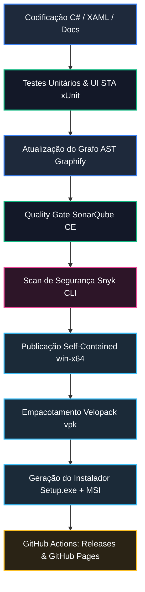

import { Card, CardGrid, Badge, Steps, Aside } from '@astrojs/starlight/components';

O **CGPDI StudyLab** foi arquitetado com padrões rigorosos de engenharia de software moderno, segurança estática, testes automatizados e empacotamento autônomo. Esta página detalha todas as ferramentas que compõem o ecossistema do projeto, explicando **o que cada ferramenta faz**, **por que ela foi escolhida** e como opera o **fluxo de desenvolvimento e publicação**.

---

## 1. Mapa de Ferramentas e Tecnologias

A tabela abaixo resume os principais componentes do ecossistema e seu papel específico no projeto:

| Ferramenta / Tecnologia | Categoria | O que faz no CGPDI StudyLab? |
| :--- | :--- | :--- |
| **.NET 10 SDK & C# 13** | *Core Framework* | Plataforma de execução com compilador JIT otimizado, suporte nativo a ponteiros `unsafe` para manipulação direta de memória de pixels (`Bgra32`) e alto desempenho gráfico. |
| **WPF (Windows Presentation Foundation)** | *UI & Renderização* | Framework de interface gráfica nativa para Windows com renderização vetorial acelerada por hardware via DirectX (Direct3D 9/11) e `Viewport3D`. |
| **Microsoft.CodeAnalysis.CSharp.Scripting (Roslyn)** | *Compilador em Tempo de Execução* | Motor de compilação C# dinâmico embutido no **Laboratório Interativo**, permitindo que estudantes escrevam e testem algoritmos com avaliação instantânea sem necessitar do Visual Studio. |
| **Velopack (`vpk` CLI 1.2.0)** | *Instalador & Atualizador Delta* | Sistema de empacotamento moderno que instala em `%LocalAppData%` (sem UAC), gera **atualizações delta** (downloads minúsculos `< 5 MB`) e aplica novos patches em segundo plano. |
| **WiX Toolset (MSI Machine-Wide)** | *Empacotador Corporativo* | Compila o instalador nativo do Windows Installer (`.msi`) para implantação automatizada em larga escala em laboratórios de informática universitários via GPO ou Microsoft Intune. |
| **SonarQube CE 26.8 (`dotnet-sonarscanner`)** | *Qualidade de Código & Cobertura* | Servidor de análise estática contínua local (`http://localhost:9000`) que inspeciona bugs, vulnerabilidades, code smells, densidade de duplicação e cobertura de testes OpenCover. |
| **Snyk CLI (Open Source & Snyk Code)** | *Segurança & SAST* | Varredura de segurança contra vulnerabilidades em dependências NuGet/npm e análise estática de segurança do código-fonte (SAST) em conformidade com padrões OWASP. |
| **Graphify** | *Grafo de Conhecimento AST* | Analisador estático que mapeia toda a arquitetura em um grafo de nós e arestas (`graphify-out/`), permitindo navegação semântica profunda e rastreamento de dependências. |
| **MinVer 7.0** | *Versionamento Semântico* | Automatiza o versionamento de compilação (`v1.0.x`) a partir das tags Git oficiais do repositório, garantindo rastreabilidade exata. |
| **xUnit + FluentAssertions + Xunit.StaFact** | *Suíte de Testes Automatizados* | Framework de testes unitários e de UI com suporte a threads STA (`[UIFact]` / `[WpfFact]`) para validar algoritmos matemáticos e componentes visuais WPF. |
| **Astro + Starlight + KaTeX + Mermaid** | *Portal de Documentação* | Motor estático gerador deste portal web (`https://cgpdi.gabrielfs.dev`), com renderização de fórmulas matemáticas KaTeX e diagramas arquiteturais Mermaid. |

---

## 2. Diagrama do Fluxo de Desenvolvimento e Release

O fluxo de trabalho do projeto segue um ciclo de qualidade estrito: nenhuma alteração é publicada sem passar por testes automatizados de regressão, portão de qualidade SonarQube e varredura de segurança.



---

## 3. Detalhamento das Etapas do Fluxo

<Steps>

1. **Desenvolvimento e Refatoração Local**

   O código-fonte é escrito em C# 13 com .NET 10. As classes de processamento de imagem utilizam ponteiros diretos (`unsafe`) sobre o `DirectBitmap`, garantindo que filtros de convolução e transformadas rodem em dezenas de frames por segundo.

2. **Execução de Testes Automatizados (xUnit + StaFact)**

   Toda funcionalidade nova ou correção de bug é acompanhada de testes unitários ou de interface. Testes de UI WPF rodam sob `Xunit.StaFact` para instanciar janelas em threads STA (*Single-Threaded Apartment*) reais.

   ```bash
   dotnet test CGPDI.StudyLab.Tests/CGPDI.StudyLab.Tests.csproj
   ```

3. **Atualização do Grafo de Conhecimento (Graphify)**

   Após modificar o código, o script de AST reconstrói o mapa de relacionamentos do projeto, indexando métodos, classes e tópicos de estudo para consulta instantânea.

   ```bash
   graphify update .
   ```

4. **Portão de Qualidade SonarQube (Local Quality Gate)**

   O script de automação inicia o SonarScanner, compila a solução, roda a suíte de testes gerando cobertura OpenCover e valida o Quality Gate (zero novos bugs, zero vulnerabilidades e cobertura de código).

   ```powershell
   powershell -ExecutionPolicy Bypass -File sonar-scan.ps1
   ```

5. **Varredura de Segurança (Snyk CLI)**

   Verificação de dependências de código aberto e análise estática SAST para prevenir injeção de código, problemas de deserialização e riscos de segurança.

   ```bash
   snyk test --all-projects
   snyk code test
   ```

6. **Publicação Self-Contained e Empacotamento (Velopack & MSI)**

   O executável é publicado como arquivo único independente (*Single-File Self-Contained*), incluindo todo o runtime do .NET 10 para que funcione em qualquer computador com Windows 10 ou 11 sem requerer instalações prévias. O Velopack empacota a release com Splash Screen temática, ícone vetorial transparente e gera o instalador corporativo MSI.

   ```powershell
   powershell -ExecutionPolicy Bypass -File build_release.ps1 -Version "1.0.11"
   ```

7. **Entrega Contínua (GitHub Actions & GitHub Pages)**

   Ao gerar uma nova tag Git (`v1.0.x`), o workflow `.github/workflows/release-app.yml` compila os instaladores, publica as notas de release extraídas do `CHANGELOG.md` e dispara a publicação do site de documentação via Astro Starlight.

</Steps>

---

## 4. Estrutura dos Instaladores Gerados

O ecossistema disponibiliza três opções de distribuição para atender a todos os cenários de uso:

<CardGrid>
  <Card title="1. Instalador Velopack (Setup.exe)" icon="rocket">
    <ul>
      <li><strong>Público:</strong> Alunos e desenvolvedores no computador pessoal.</li>
      <li><strong>Instalação:</strong> Diretório <code>%LocalAppData%\CGPDIStudyLab</code> sem requerer privilégios de administrador.</li>
      <li><strong>Atualização:</strong> Automática e inteligente com pacotes delta menores que 5 MB.</li>
      <li><strong>Visual:</strong> Splash screen temática Dark Slate & Glass com barra em Ciano.</li>
    </ul>
  </Card>

  <Card title="2. Instalador Machine-Wide (.msi)" icon="setting">
    <ul>
      <li><strong>Público:</strong> Equipes de TI e laboratórios universitários compartilhados.</li>
      <li><strong>Instalação:</strong> Diretório <code>C:\Program Files\CGPDIStudyLab</code> disponível para todos os usuários do Windows.</li>
      <li><strong>Implantação:</strong> Suporte nativo a GPO, Microsoft Intune, SCCM e instalação silenciosa (<code>msiexec /i CGPDI-StudyLab-MachineWide.msi /quiet</code>).</li>
    </ul>
  </Card>

  <Card title="3. Pacote Portátil Zero-Admin (.zip)" icon="laptop">
    <ul>
      <li><strong>Público:</strong> Apresentações em sala de aula e computadores restritos.</li>
      <li><strong>Instalação:</strong> Nenhuma. Basta descompactar em um pendrive ou pasta temporária e executar o <code>.exe</code> direto.</li>
    </ul>
  </Card>
</CardGrid>

---

## 5. Blindagem contra Ataques na Cadeia de Suprimentos (npm & .NET/NuGet)

Diante do crescimento de ataques a repositórios de pacotes públicos (malware em scripts `postinstall`/MSBuild `.targets`, *typosquatting*, *dependency confusion* e contaminação de dependências menores), o **CGPDI StudyLab** adota uma política rigorosa de **segurança em profundidade com privilégio zero** em ambos os ecossistemas:

### A. Blindagem no Ecossistema Node.js / npm (`.npmrc`)

<CardGrid>
  <Card title="Bloqueio de Scripts (ignore-scripts=true)" icon="warning">
    Desativa a execução automática de scripts de ciclo de vida (`preinstall`, `postinstall`, `prepare`) de pacotes de terceiros, neutralizando o vetor mais comum de roubo de credenciais e execução remota de código (RCE).
  </Card>

  <Card title="Versões Fixas (save-exact=true)" icon="approve-check">
    Todas as dependências são registradas com versão exata no <code>package.json</code> (sem <code>^</code> ou <code>~</code>), impedindo downloads automáticos de releases contaminadas.
  </Card>

  <Card title="Integridade de Lockfile (package-lock=true)" icon="lock">
    Exige validação rigorosa de hash SHA-512 e integridade de cada submódulo durante o <code>npm ci</code> nos pipelines de CI/CD.
  </Card>

  <Card title="Registry Oficial e Auditoria Ativa" icon="shield">
    Conexão restrita ao <code>https://registry.npmjs.org/</code> com <code>audit=true</code> e <code>audit-level=high</code>, integrando scans estáticos via Snyk.
  </Card>
</CardGrid>

```ini title=".npmrc"
# Bloqueio de execução arbitrária de código em pacotes
ignore-scripts=true

# Fixação determinística de versões (anti-poisoning)
save-exact=true

# Validação e integridade obrigatória do lockfile
package-lock=true

# Registry oficial HTTPS
registry=https://registry.npmjs.org/

# Auditoria contínua de vulnerabilidades
audit=true
audit-level=high

# Validação estrita de engine Node/npm
engine-strict=true
fund=false
```

### B. Blindagem no Ecossistema .NET / C# (`nuget.config` & `Directory.Build.props`)

O ecossistema .NET é protegido contra injeção de tarefas maliciosas no MSBuild (`.targets`/`.props`) e *Dependency Confusion*:

<CardGrid>
  <Card title="Mapeamento de Fontes (Package Source Mapping)" icon="setting">
    Limpa feeds locais/não confiáveis (<code>&lt;clear /&gt;</code>) no <code>nuget.config</code> e vincula padrões de pacotes exclusivamente ao feed oficial HTTPS do nuget.org, bloqueando ataques de *Dependency Confusion*.
  </Card>

  <Card title="Lockfiles Determinísticos (packages.lock.json)" icon="lock">
    Ativa <code>RestorePackagesWithLockFile</code> globalmente via <code>Directory.Build.props</code>, congelando a árvore inteira de dependências diretas e transitivas com hashes SHA-512.
  </Card>

  <Card title="Auditoria Integrada (NuGetAudit)" icon="shield">
    Audita vulnerabilidades em tempo de restore para todas as dependências diretas e transitivas (<code>NuGetAuditMode=all</code>) com severidade alta (<code>NuGetAuditLevel=high</code>).
  </Card>

  <Card title="Validação de Assinaturas Digitais" icon="approve-check">
    Configura <code>signatureValidationMode=accept</code> no <code>nuget.config</code>, garantindo autenticidade dos binários distribuídos.
  </Card>
</CardGrid>

```xml title="nuget.config"
<?xml version="1.0" encoding="utf-8"?>
<configuration>
  <!-- Limpa fontes arbitrárias ou locais não confiáveis -->
  <packageSources>
    <clear />
    <add key="nuget.org" value="https://api.nuget.org/v3/index.json" protocolVersion="3" />
  </packageSources>

  <!-- Mapeamento estrito de pacotes contra Dependency Confusion -->
  <packageSourceMapping>
    <packageSource key="nuget.org">
      <package pattern="*" />
    </packageSource>
  </packageSourceMapping>

  <config>
    <add key="signatureValidationMode" value="accept" />
  </config>
</configuration>
```

```xml title="Directory.Build.props"
<Project>
  <PropertyGroup>
    <!-- Lockfiles determinísticos com hashes SHA-512 -->
    <RestorePackagesWithLockFile>true</RestorePackagesWithLockFile>
    
    <!-- Auditoria contínua de vulnerabilidades em dependências diretas e transitivas -->
    <NuGetAudit>true</NuGetAudit>
    <NuGetAuditMode>all</NuGetAuditMode>
    <NuGetAuditLevel>high</NuGetAuditLevel>
    <WarningsAsErrors>$(WarningsAsErrors);NU1901;NU1902;NU1903;NU1904</WarningsAsErrors>
  </PropertyGroup>
</Project>
```

---

## 6. Cheat-Sheet de Comandos Úteis

```bash
# Compilar a solução inteira
dotnet build CGPDI.StudyLab.slnx

# Executar todos os testes com saída detalhada
dotnet test CGPDI.StudyLab.Tests/CGPDI.StudyLab.Tests.csproj

# Rodar análise completa do SonarQube com cobertura
powershell -ExecutionPolicy Bypass -File sonar-scan.ps1

# Gerar release local completa (Executável + ZIP + Setup.exe + MSI)
powershell -ExecutionPolicy Bypass -File build_release.ps1 -Version "1.0.11"

# Iniciar o portal de documentação localmente
cd docs && npm run dev

# Validar compilação estática do Astro Docs
cd docs && npm test
```
