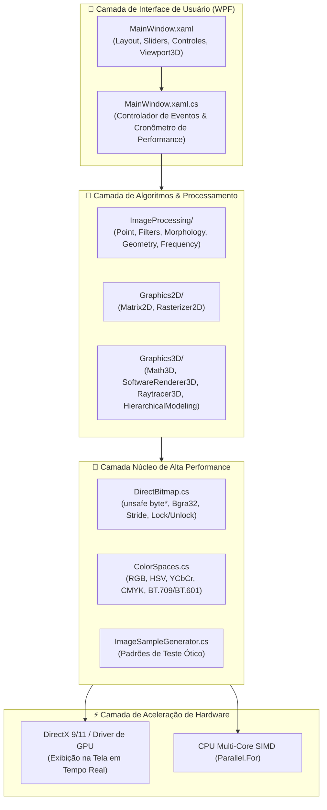

O **CGPDI.StudyLab** foi arquitetado seguindo o padrão de **Engenharia de Software em Camadas (Layered Architecture)**, separando rigidamente os cálculos matemáticos puros da renderização de tela e da interface com o usuário.

---

## 🏛️ Diagrama em Camadas

---

## 🔄 Fluxo de Execução de um Algoritmo

Quando você clica em um botão na interface (por exemplo, aplicar o filtro **Gaussiano** ou renderizar uma **Cena 3D**):

1. **Disparo do Evento:** O usuário interage com um botão ou arrasta um slider no `MainWindow.xaml`.
2. **Coleta de Parâmetros:** O método manipulador em `MainWindow.xaml.cs` lê os valores dos sliders (como $\sigma = 1.5$ ou raio $r = 3$).
3. **Início do Cronômetro:** Um cronômetro de precisão nanométrica (`System.Diagnostics.Stopwatch`) é iniciado.
4. **Processamento Paralelo em Memória:**
   - O algoritmo correspondente (ex: `SpatialFilters.ApplyGaussianBlur`) é chamado.
   - O `DirectBitmap` de origem e destino têm seus buffers bloqueados com `.Lock()`.
   - O comando `Parallel.For` distribui as linhas da imagem entre todos os núcleos da CPU.
   - Nenhum objeto novo é alocado no laço para evitar trabalho ao *Garbage Collector*.
5. **Notificação de Redesenho:** O `DirectBitmap.Unlock(markDirty: true)` avisa o WPF que os pixels mudaram através de `AddDirtyRect`.
6. **Aceleração por DirectX:** O WPF envia o buffer `Bgra32` diretamente para a memória da placa de vídeo para exibição instantânea.
7. **Exibição do Tempo:** O cronômetro é parado e a interface exibe o tempo exato em milissegundos (ex: `⏱️ 1.2 ms (833 FPS)`).

---

## ⚡ Por que a Aplicação é Tão Rápida?

Três princípios de engenharia garantem que o laboratório rode com taxas de centenas de quadros por segundo:

1. **Acesso Unsafe a Ponteiros:** Elimina validações redundantes de checagem de limites feitas pelo C# padrão a cada pixel.
2. **Localidade de Cache da CPU:** O acesso à memória é sempre feito de forma estritamente sequencial linha a linha (horizontalmente), garantindo taxa máxima de acerto no cache L1/L2/L3 do processador.
3. **Zero Alocação no Laço Crítico:** Variáveis auxiliares são mantidas na pilha de execução (*Stack*) e não no *Heap*, mantendo a coleta de lixo em zero durante animações.

---

👉 **Próximo Passo:** Explore a [Estrutura Detalhada de Pastas e Arquivos](/CGPDI.StudyLab/arquitetura/estrutura-de-pastas/).
