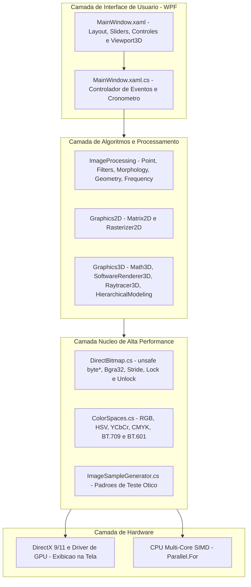

O **CGPDI.StudyLab** foi arquitetado seguindo o padrão de **Engenharia de Software em Camadas (Layered Architecture)**, separando os cálculos matemáticos puros da exibição na tela e dos controles de interface.

---

## 1. Diagrama Arquitetural em Camadas

---

## 2. Fluxo de Execução de um Algoritmo

Quando você aciona um botão na interface (por exemplo, aplicar o filtro **Gaussiano** ou renderizar uma **Cena 3D**):

1. **Disparo do Evento:** O usuário interage com um botão ou slider no `MainWindow.xaml`.
2. **Coleta de Parâmetros:** O método no `MainWindow.xaml.cs` obtém os valores dos controles (como $\sigma = 1.5$ ou raio $r = 3$).
3. **Início do Cronômetro:** Um cronômetro de alta precisão (`System.Diagnostics.Stopwatch`) é acionado.
4. **Processamento Paralelo em Memória:**
   - O algoritmo correspondente (ex: `SpatialFilters.ApplyGaussianBlur`) é chamado.
   - O buffer do `DirectBitmap` é bloqueado com `.Lock()`.
   - O comando `Parallel.For` distribui as linhas horizontais da imagem entre todos os núcleos da CPU.
   - Não há alocação desnecessária de objetos dentro dos laços, mantendo o *Garbage Collector* ocioso.
5. **Notificação de Redesenho:** O método `DirectBitmap.Unlock(markDirty: true)` sinaliza ao WPF que a área da imagem foi alterada via `AddDirtyRect`.
6. **Aceleração por DirectX:** O WPF envia o buffer `Bgra32` para a placa de vídeo para exibição instantânea.
7. **Exibição do Tempo:** O cronômetro é encerrado e a interface exibe o tempo em milissegundos (ex: `1.2 ms - 833 FPS`).

---

## 3. Pilares de Desempenho

Três decisões de engenharia garantem taxas elevadas de quadros por segundo:

1. **Ponteiros Não Gerenciados (`unsafe byte*`):** Elimina o custo de chamadas intermediárias a cada pixel.
2. **Localidade de Cache da CPU:** O percurso da memória é linear (horizontal), maximizando o acerto no cache L1/L2/L3.
3. **Alocação Zero no Laço Crítico:** Os cálculos utilizam apenas variáveis primitivas na pilha de execução (*Stack*).

---

  <h4>📚 Referências Oficiais Microsoft Learn</h4>
  
Conceitos fundamentais da arquitetura de aplicações de alto desempenho no ecossistema .NET:

  <ul>
    <li><a href="https://learn.microsoft.com/pt-br/dotnet/desktop/wpf/introduction-to-wpf#wpf-architecture" target="_blank" rel="noopener">Visão Geral da Arquitetura do WPF</a> — Entenda como o PresentationCore, MediaContext e o subsistema milcore/DirectX interagem.</li>
    <li><a href="https://learn.microsoft.com/pt-br/dotnet/desktop/wpf/advanced/graphics-rendering-tiers" target="_blank" rel="noopener">Níveis de Renderização de Gráficos (Graphics Tiers)</a> — Como o WPF gerencia aceleração por hardware (Tier 0, 1 e 2).</li>
    <li><a href="https://learn.microsoft.com/pt-br/dotnet/standard/design-guidelines/" target="_blank" rel="noopener">Diretrizes de Design do Framework .NET</a> — Padrões arquiteturais para desacoplamento e manutenibilidade.</li>
  </ul>

---

👉 **Próximo Passo:** Explore a [Estrutura Detalhada de Pastas e Arquivos](/CGPDI.StudyLab/arquitetura/estrutura-de-pastas/).
