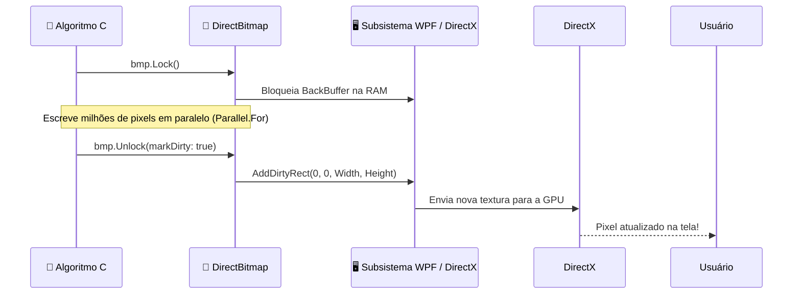

O **Windows Presentation Foundation (WPF)** é o subsistema gráfico do Windows que alimenta a interface do usuário do **CGPDI.StudyLab**. Mas como ele consegue desenhar gráficos tão rápido e integrar código C# com aceleração por hardware?

---

## 🎨 1. O que é XAML e Como Ele Funciona?

**XAML** (*Extensible Application Markup Language*) é uma linguagem baseada em XML usada para declarar visualmente a interface.

Em vez de você ter que escrever linhas e linhas de código C# como:
```csharp
Button btn = new Button();
btn.Content = "Aplicar Filtro";
btn.Width = 150;
painel.Children.Add(btn);
```

No XAML você escreve de forma declarativa e limpa:
```xml
<Button Content="✨ Aplicar Filtro Gaussiano" 
        Width="180" Height="36"
        Background="#1e293b" Foreground="#38bdf8"
        Click="BtnApplyGaussian_Click" />
```

No **`MainWindow.xaml`** do projeto, nós organizamos a tela em:
1. **Cabeçalho:** Logotipo, título do laboratório e seletores rápidos.
2. **Abas Principais (`TabControl`):**
   - 🖼️ Processamento Digital de Imagens (PDI)
   - ✏️ Computação Gráfica 2D (Rasterização)
   - 🧊 Computação Gráfica 3D (Hardware DirectX)
   - ⚡ Software 3D & Ray Tracing (CPU Puro)
   - 📖 Central de Estudos e Guia Teórico
3. **Painéis Laterais de Controle (`StackPanel` e `ScrollViewer`):** Contêm os sliders de parâmetros, botões de ação e caixas de seleção.
4. **Visor Central (`Image` e `Viewport3D`):** Onde o resultado dos pixels processados e os objetos 3D são exibidos.

---

## ⚡ 2. Como o WPF se Conecta com o DirectX?

Aplicações clássicas de Windows (como o Windows Forms do .NET antigo) usavam uma tecnologia chamada **GDI+**, que desenhava tudo na CPU pixel a pixel, tornando animações e processamento de imagem lentos e travados.

O **WPF**, por outro lado, usa uma arquitetura de renderização baseada em **DirectX**:
- Cada controle visual, botão e imagem na tela é convertido internamente em uma textura ou triângulo 3D enviado para a placa de vídeo (GPU).
- A composição final da janela é realizada pela GPU a **60 ou 120 FPS** com taxa de atualização nativa do monitor.

---

## 🖼️ 3. O Segredo do `WriteableBitmap`

Para exibir uma imagem calculada pelo nosso algoritmo C# (como um filtro de Canny ou uma cena de Ray Tracing), usamos o controle **`WriteableBitmap`**:

```csharp
// 1. Criamos uma imagem vazia na memória com formato Bgra32
WriteableBitmap wbmp = new WriteableBitmap(512, 512, 96, 96, PixelFormats.Bgra32, null);

// 2. Vinculamos o Bitmap ao controle de Imagem na tela XAML
MyImageControl.Source = wbmp;
```

### O Ciclo de Bloqueio e Liberação (`Lock` / `Unlock`):
Quando alteramos os pixels em memória com ponteiros, precisamos garantir que o WPF não tente desenhar a imagem enquanto ainda estamos escrevendo nela (evitando o efeito de *screen tearing*):



---

## 🎮 4. O `Viewport3D` do WPF

Para a aba de Computação Gráfica 3D acelerada por hardware, o WPF fornece o elemento **`<Viewport3D>`**.

Ele encapsula todo o pipeline 3D nativo:
- **Câmera:** `<PerspectiveCamera>` que define a posição do observador $(X, Y, Z)$, o vetor de direção do olhar e o campo de visão (*Field of View - FOV*).
- **Luzes:** `<DirectionalLight>`, `<PointLight>` e `<AmbientLight>` que iluminam os modelos poligonais.
- **Modelos:** `<GeometryModel3D>` contendo a malha de triângulos (`MeshGeometry3D`) e os materiais de superfície (`DiffuseMaterial` e `SpecularMaterial`).

---

👉 **Próximo Passo:** Entre no [Módulo de Núcleo de Memória & Ponteiros](/CGPDI.StudyLab/core/fundamentos-de-memoria/).
