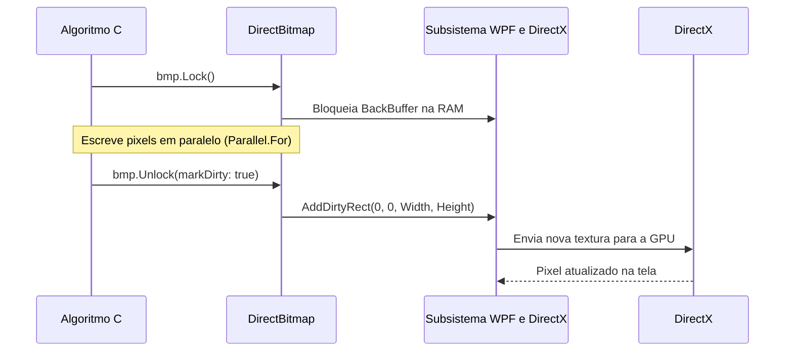

O **Windows Presentation Foundation (WPF)** é o subsistema gráfico do Windows que gerencia a interface do usuário do **CGPDI.StudyLab**.

---

## 1. O que é XAML e Como Ele Funciona?

### A Analogia da Planta Baixa da Casa:
Pense no **XAML** (*Extensible Application Markup Language*) como a planta baixa desenhada por um arquiteto: ela diz onde fica cada porta, janela e interruptor de forma limpa e organizada.

Em vez de escrever dezenas de linhas manuais para instanciar controles:
```csharp
Button btn = new Button();
btn.Content = "Aplicar Filtro";
btn.Width = 150;
painel.Children.Add(btn);
```

No XAML, declaramos a estrutura de forma visual:
```xml
<Button Content="Aplicar Filtro Gaussiano" 
        Width="180" Height="36"
        Background="#1e293b" Foreground="#38bdf8"
        Click="BtnApplyGaussian_Click" />
```

No **`MainWindow.xaml`**, a janela principal é dividida em:
1. **Cabeçalho:** Logotipo, título do laboratório e seletores gerais.
2. **Abas Principais (`TabControl`):**
   - Processamento Digital de Imagens (PDI)
   - Computação Gráfica 2D (Rasterização)
   - Computação Gráfica 3D (Hardware DirectX)
   - Software 3D & Ray Tracing (CPU)
   - Central de Estudos e Guia Teórico
3. **Painéis Laterais de Controle (`StackPanel` e `ScrollViewer`):** Contêm os sliders de parâmetros, botões de ação e caixas de seleção.
4. **Visor Central (`Image` e `Viewport3D`):** Onde o resultado dos pixels processados e os objetos 3D são exibidos.

---

## 2. Como o WPF se Conecta com o DirectX?

Aplicações clássicas do Windows (como o Windows Forms antigo) utilizavam o **GDI+**, que desenhava tudo na CPU pixel a pixel.

O **WPF** utiliza internamente o **DirectX**:
- Cada controle visual, botão e imagem na tela é convertido internamente em uma textura ou triângulo 3D gerenciado pela GPU.
- A composição final da janela é executada pela placa de vídeo em sincronia com a taxa de atualização do monitor.

---

## 3. O Papel do `WriteableBitmap`

Para exibir uma imagem calculada pelo nosso algoritmo C# (como um filtro de Canny ou uma cena de Ray Tracing), usamos o controle **`WriteableBitmap`**:

```csharp
// Cria uma imagem vazia na memoria com formato Bgra32:
WriteableBitmap wbmp = new WriteableBitmap(512, 512, 96, 96, PixelFormats.Bgra32, null);

// Vincula o Bitmap ao controle de Imagem na tela XAML:
MyImageControl.Source = wbmp;
```

### O Ciclo de Bloqueio e Liberação (`Lock` / `Unlock`):



---

## 4. O `Viewport3D` do WPF

Para a exibição 3D acelerada por hardware, o WPF fornece o elemento **`<Viewport3D>`**:
- **Câmera:** `<PerspectiveCamera>` que define a posição do observador $(X, Y, Z)$, o vetor de direção do olhar e o campo de visão (*Field of View - FOV*).
- **Luzes:** `<DirectionalLight>`, `<PointLight>` e `<AmbientLight>` que iluminam os modelos poligonais.
- **Modelos:** `<GeometryModel3D>` contendo a malha de triângulos (`MeshGeometry3D`) e os materiais de superfície (`DiffuseMaterial` e `SpecularMaterial`).

---

<div class="ms-ref-card">
  <h4>📚 Referências Oficiais Microsoft Learn</h4>
  <p>Recursos fundamentais para desenvolvimento com WPF e XAML no .NET:</p>
  <ul>
    <li><a href="https://learn.microsoft.com/pt-br/dotnet/desktop/wpf/fundamentals/xaml" target="_blank" rel="noopener">Visão Geral da Linguagem XAML no WPF</a> — Sintaxe declarativa, propriedades de dependência e ciclo de vida de elementos visuais.</li>
    <li><a href="https://learn.microsoft.com/pt-br/dotnet/desktop/wpf/graphics-multimedia/3-d-graphics-overview" target="_blank" rel="noopener">Visão Geral de Gráficos 3D no WPF</a> — Criação de malhas <code>MeshGeometry3D</code>, iluminação e gerenciamento de câmeras.</li>
    <li><a href="https://learn.microsoft.com/pt-br/dotnet/desktop/wpf/advanced/threading-model" target="_blank" rel="noopener">Modelo de Threading do WPF (Dispatcher)</a> — Entenda o Dispatcher e como atualizar elementos de interface a partir de threads secundárias.</li>
  </ul>
</div>

---

👉 **Próximo Passo:** Entre no [Módulo de Núcleo de Memória & Ponteiros](/core/fundamentos-de-memoria/).
