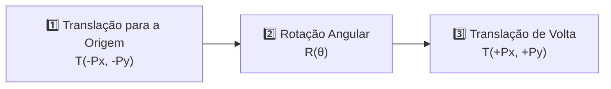

A base matemática de toda a Computação Gráfica moderna é a **Álgebra Linear Matricial**.

O arquivo [`Matrix2D.cs`](https://github.com/Gabriel-Freitas-S/CGPDI.StudyLab/blob/main/CGPDI.StudyLab/Graphics2D/Matrix2D.cs) encapsula as matrizes de transformação afim no plano bidimensional.

---

## ❓ 1. Por que Usamos Matrizes $3 \times 3$ no Espaço 2D?

No plano bidimensional, rotação e escala podem ser representadas por matrizes $2 \times 2$:

$$
\begin{bmatrix} x' \\ y' \end{bmatrix} = \begin{bmatrix} \cos\theta & -\sin\theta \\ \sin\theta & \cos\theta \end{bmatrix} \begin{bmatrix} x \\ y \end{bmatrix}
$$

Entretanto, a **Translação** $(x + t_x, \; y + t_y)$ é uma soma vetorial, **não uma multiplicação linear** de matriz $2 \times 2$. Isso impediria encadear rotações e translações em uma única matriz!

### A Solução: Coordenadas Homogêneas ($x, y, 1$)
Ao adicionar uma terceira dimensão auxiliar $w = 1$, conseguimos unificar todas as transformações afins em **matrizes $3 \times 3$** que podem ser multiplicadas entre si:

$$
\begin{bmatrix} x' \\ y' \\ 1 \end{bmatrix} = 
\begin{bmatrix} 
m_{00} & m_{01} & m_{02} \\ 
m_{10} & m_{11} & m_{12} \\ 
0 & 0 & 1 
\end{bmatrix} 
\begin{bmatrix} x \\ y \\ 1 \end{bmatrix}
$$

---

## 📐 2. As Matrizes Elementares 2D

### 1. Matriz Identidade ($I$)
$$
I = \begin{bmatrix} 1 & 0 & 0 \\ 0 & 1 & 0 \\ 0 & 0 & 1 \end{bmatrix}
$$

### 2. Matriz de Translação ($T$)
$$
T(t_x, t_y) = \begin{bmatrix} 1 & 0 & t_x \\ 0 & 1 & t_y \\ 0 & 0 & 1 \end{bmatrix}
$$

### 3. Matriz de Rotação em Torno da Origem ($R$)
$$
R(\theta) = \begin{bmatrix} \cos\theta & -\sin\theta & 0 \\ \sin\theta & \cos\theta & 0 \\ 0 & 0 & 1 \end{bmatrix}
$$

### 4. Matriz de Escala ($S$)
$$
S(s_x, s_y) = \begin{bmatrix} s_x & 0 & 0 \\ 0 & s_y & 0 \\ 0 & 0 & 1 \end{bmatrix}
$$

### 5. Matriz de Cisalhamento / Deformação Angular ($Sh$)
$$
Sh(k_x, k_y) = \begin{bmatrix} 1 & k_x & 0 \\ k_y & 1 & 0 \\ 0 & 0 & 1 \end{bmatrix}
$$

---

## 🔄 3. Rotação em Torno de um Ponto Arbitrário $(P_x, P_y)$

Para rotacionar um polígono ao redor de seu próprio centro e não da origem $(0,0)$ da tela:

$$
M_{\text{final}} = T(P_x, P_y) \times R(\theta) \times T(-P_x, -P_y)
$$

:::caution[Atenção à Ordem de Multiplicação]
A multiplicação de matrizes **não é comutativa** ($A \times B \neq B \times A$). A ordem das operações afeta radicalmente o resultado visual!
:::

---

👉 **Próximo Passo:** Aprenda sobre os [Algoritmos de Traçado de Retas (Bresenham e Wu)](/CGPDI.StudyLab/cg2d/algoritmos-de-linhas/).
