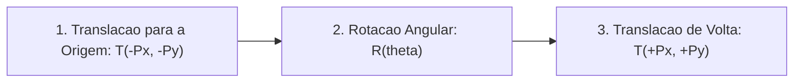

A base matemática de toda a Computação Gráfica é a **Álgebra Linear Matricial**.

O arquivo [`Matrix2D.cs`](https://github.com/Gabriel-Freitas-S/CGPDI.StudyLab/blob/main/CGPDI.StudyLab/Graphics2D/Matrix2D.cs) encapsula as matrizes de transformação afim no plano bidimensional, e o WPF implementa essas operações nativamente através de `TransformGroup`, `RotateTransform` e `TranslateTransform`.

---

## 1. Por que Usamos Matrizes 3x3 no Espaço 2D?

No plano bidimensional, rotação e escala podem ser calculadas por matrizes $2 \times 2$:

$$
\begin{bmatrix} x' \\ y' \end{bmatrix} = \begin{bmatrix} \cos\theta & -\sin\theta \\ \sin\theta & \cos\theta \end{bmatrix} \begin{bmatrix} x \\ y \end{bmatrix}
$$

Entretanto, mover um ponto de lugar (**Translação**) exige uma soma $(x + t_x, \; y + t_y)$, e somas não podem ser multiplicadas diretamente com matrizes $2 \times 2$.

### A Solução: Coordenadas Homogêneas ($x, y, 1$)
Ao adicionar uma dimensão auxiliar $w = 1$, conseguimos unificar todas as operações (translação, rotação, escala) em **matrizes $3 \times 3$**:

$$
\begin{bmatrix} x' \\ y' \\ 1 \end{bmatrix} = 
\begin{bmatrix} 
m_{00} & m_{01} & m_{02} \\ 
m_{10} & m_{11} & m_{12} \\ 
0 & 0 & 1 
\end{bmatrix} 
\begin{bmatrix} x \\ y \\ 1 \end{bmatrix}
$$

---

## 2. Matrizes Elementares 2D

- **Translação:** Move o objeto no plano por $(t_x, t_y)$.
- **Rotação:** Gira o objeto por um ângulo $\theta$.
- **Escala:** Aumenta ou diminui o tamanho do objeto por $(s_x, s_y)$.
- **Cisalhamento (Shear):** Inclina e deforma a geometria lateralmente.

---

## 3. Rotação ao Redor de um Ponto Arbitrário

Para girar um desenho ao redor do seu próprio centro $(P_x, P_y)$:



$$
M_{\text{final}} = T(P_x, P_y) \times R(\theta) \times T(-P_x, -P_y)
$$

:::caution[Ordem de Multiplicação]
A multiplicação de matrizes **não é comutativa** ($A \times B \neq B \times A$). A ordem das operações afeta diretamente o resultado visual.
:::

---

## 4. Reutilização com ControlTemplates e Animações com AutoReverse

No ecossistema WPF, matrizes de transformação são aplicadas modularmente a geometrias definidas em `ControlTemplates`:

```xml
<!-- Template de Ponteiro/Raio Modular -->
<ControlTemplate x:Key="PonteiroTemplate">
    <Polygon Points="0,0 -4,-18 0,-50 4,-18" Fill="#38BDF8"/>
</ControlTemplate>

<!-- Instanciação com Rotação Pivotada -->
<Control Template="{StaticResource PonteiroTemplate}">
    <Control.RenderTransform>
        <RotateTransform Angle="45" CenterX="0" CenterY="0"/>
    </Control.RenderTransform>
</Control>
```

### Animações Contínuas Bidirecionais
Ao aplicar `DoubleAnimation` em conjunto com a propriedade `AutoReverse="True"`, a linha do tempo interpola o trajeto até o valor final e, ao término, reproduz a interpolação em sentido inverso automaticamente, mantendo a coerência física em veículos e mecanismos articulados.

---

<div class="ms-ref-card">
  <h4>Referências Oficiais Microsoft Learn</h4>
  <ul>
    <li><a href="https://learn.microsoft.com/pt-br/dotnet/desktop/wpf/graphics-multimedia/transforms-overview" target="_blank" rel="noopener">Visão Geral de Transformações no WPF</a> — Classes RotateTransform, TranslateTransform e MatrixTransform.</li>
    <li><a href="https://learn.microsoft.com/pt-br/dotnet/api/system.windows.media.animation.timeline.autoreverse" target="_blank" rel="noopener">Classe Timeline.AutoReverse Property</a> — Como criar animações cíclicas bidirecionais suaves.</li>
  </ul>
</div>

---

**Próximo Passo:** Aprenda sobre os [Algoritmos de Traçado de Retas (Bresenham e Wu)](/cg2d/algoritmos-de-linhas/).
