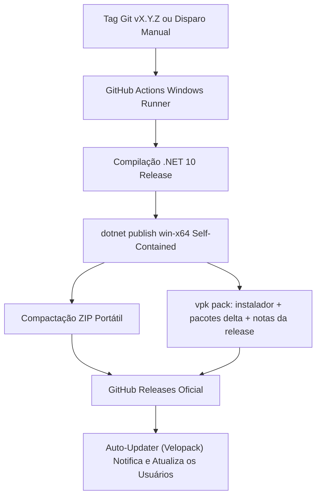

O projeto [`CGPDI.StudyLab`](https://github.com/Gabriel-Freitas-S/CGPDI.StudyLab) conta com uma esteira completa de **Integração e Entrega Contínuas (CI/CD)** dividida em dois workflows:

1. **Deploy Contínuo da Documentação**: Compila o site Astro Starlight e publica no GitHub Pages.
2. **Build & Release do Aplicativo Windows**: Compila o .NET 10, empacota com [Velopack](https://velopack.io) (instalador + pacotes delta), gera o executável portátil (`.zip`) e publica no GitHub Releases.

---

## 🚀 1. Pipeline de Release do Aplicativo (`release-app.yml`)

O workflow [`.github/workflows/release-app.yml`](https://github.com/Gabriel-Freitas-S/CGPDI.StudyLab/blob/main/.github/workflows/release-app.yml) é disparado automaticamente ao criar uma tag (ex: `v1.0.1`) ou manualmente via `workflow_dispatch`:



### Artefatos Gerados em Cada Release:
* **`Setup.exe`**: Instalador Velopack para Windows com atalhos na Área de Trabalho e Menu Iniciar. Instala em `%LocalAppData%` (sem UAC) **ou para todos os usuários** (requer administrador, ex.: laboratórios), com atualizações delta automáticas.
* **`CGPDI-StudyLab-MachineWide.msi`**: Instalador **MSI** para implantação machine-wide via GPO/Intune pela equipe de TI (cria a tarefa SYSTEM de auto-update).
* **`CGPDI-StudyLab-Portable-win-x64.zip`**: Versão portátil autônoma pronta para rodar sem necessidade de instalação ou direitos de administrador.
* **Pacotes `.nupkg` (full + delta)**: Usados pelo auto-updater para baixar apenas as alterações entre versões.

---

## 🔄 2. Sistema de Auto-Update Integrado

O aplicativo possui um sistema inteligente de verificação e atualização automática ([`UpdateManager.cs`](file:///d:/source/repos/CGPDI.StudyLab/CGPDI.StudyLab/Core/UpdateManager.cs)) baseado no [Velopack](https://velopack.io):

1. **Verificação em Segundo Plano:** Ao iniciar, o app consulta o feed do Velopack no GitHub Releases de forma não bloqueante (com fallback para a API do GitHub em execuções portáteis).
2. **Diálogo de Atualização:** Se uma versão mais recente for encontrada (ex: `v1.0.1 > v1.0.0`), uma janela moderna exibe o changelog (extraído do `CHANGELOG.md` na release) e pergunta ao usuário se deseja atualizar.
3. **Download Delta e Aplicação Automática:**
   - **Instalado (Velopack, por usuário):** Baixa apenas o pacote **delta** (alterações desde a versão atual), aplica e reinicia o app sem pedir permissão de administrador.
   - **Instalado (Velopack, todos os usuários):** Sem privilégios de administrador, o app delega a atualização a um processo em segundo plano — pela **tarefa agendada SYSTEM** criada na instalação ou reiniciando-se elevado (UAC) — e aplica tudo sozinho, sem depender da TI.
   - **Portátil:** Baixa o `.zip`, descompacta em segundo plano e reinicia a aplicação atualizada.
4. **Preferências do usuário:** "Lembrar mais tarde" adia a notificação por 7 dias e "Ignorar esta versão" oculta a versão, persistidos localmente.
5. **Verificação Manual:** O botão **`🔔 Atualizações`** na barra superior permite checar novidades a qualquer momento.

---

## 🌐 3. Deploy da Documentação no GitHub Pages (`deploy-docs.yml`)

O repositório inclui o workflow [`.github/workflows/deploy-docs.yml`](https://github.com/Gabriel-Freitas-S/CGPDI.StudyLab/blob/main/.github/workflows/deploy-docs.yml) que sincroniza a documentação a cada commit na branch `main`. O workflow gera o arquivo `CNAME` automaticamente, habilitando o domínio customizado.

A documentação está publicada em:
👉 **`https://cgpdi.gabrielfs.dev`**

Para que o domínio funcione, o DNS do provedor deve apontar para o GitHub Pages:

| Tipo | Nome | Valor |
| :--- | :--- | :--- |
| `CNAME` | `cgpdi.gabrielfs.dev` | `gabriel-freitas-s.github.io` |

Além do registro DNS, o domínio `cgpdi.gabrielfs.dev` deve estar cadastrado em **Settings → Pages → Custom domain** do repositório. O `CNAME` embutido no artefato de deploy garante que ele seja recriado a cada publicação.

---

## 💻 4. Geração Local de Release

Para compilar o pacote de release localmente sem enviar para o GitHub, basta executar o script PowerShell:

```powershell
.\build_release.ps1 -Version "1.0.0"
```

Os arquivos finais serão gerados na pasta `dist/`.
