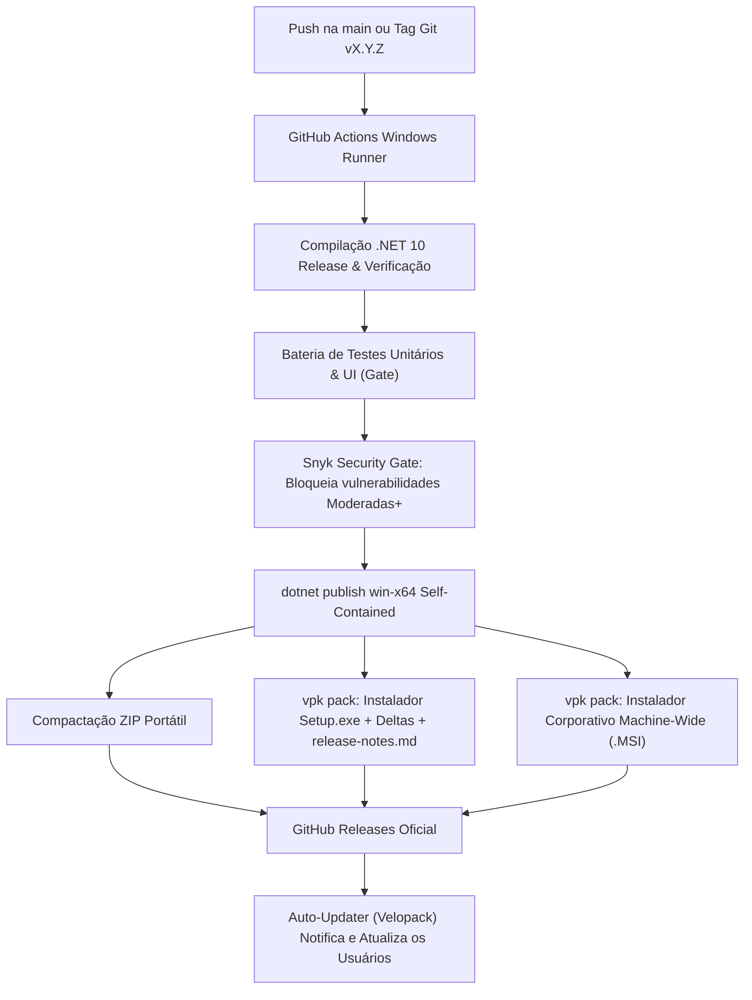

O projeto [`CGPDI.StudyLab`](https://github.com/Gabriel-Freitas-S/CGPDI.StudyLab) conta com uma esteira completa de **Integração e Entrega Contínuas (CI/CD)** e **Segurança DevSecOps** automatizada no GitHub Actions, composta por quatro pilares:

1. **Deploy Contínuo da Documentação (`deploy-docs.yml`)**: Validação com Snyk, compilação do site Astro Starlight e publicação no GitHub Pages com domínio customizado.
2. **Build & Release do Aplicativo Windows (`release-app.yml`)**: Gate de testes automatizados, gate de segurança Snyk, compilação do .NET 10, empacotamento com [Velopack](https://velopack.io) (instalador + pacotes delta), geração do instalador MSI corporativo, executável portátil (`.zip`) e publicação no GitHub Releases.
3. **Análise Contínua de Segurança Snyk (`snyk-security.yml`)**: Varredura de dependências NuGet e npm, análise estática SAST de código C# (Snyk Code), envio de relatórios SARIF para o GitHub Security e hard gate bloqueando vulnerabilidades moderadas ou superiores (`--severity-threshold=medium`).
4. **Análise Avançada de Código CodeQL (`codeql.yml`)**: Varredura semântica profunda de código C# e workflows GitHub Actions via **CodeQL Action v4** (Node 24).

---

## 🚀 1. Pipeline de Release do Aplicativo (`release-app.yml`)

O workflow [`.github/workflows/release-app.yml`](https://github.com/Gabriel-Freitas-S/CGPDI.StudyLab/blob/main/.github/workflows/release-app.yml) é disparado automaticamente a cada push na branch `main`, na criação de tags (ex: `v1.0.5`) ou manualmente via `workflow_dispatch`:



### Artefatos Gerados em Cada Release:
* **`Setup.exe`**: Instalador Velopack para Windows com atalhos na Área de Trabalho e Menu Iniciar. Instala em `%LocalAppData%` (sem UAC) **ou para todos os usuários** (requer administrador, ex.: laboratórios), com atualizações delta automáticas.
* **`CGPDI-StudyLab-MachineWide.msi`**: Instalador **MSI** para implantação em lote via GPO/Intune pela equipe de TI.
* **`CGPDI-StudyLab-Portable-win-x64.zip`**: Versão portátil autônoma pronta para rodar sem necessidade de instalação ou direitos de administrador.
* **Pacotes `.nupkg` (full + delta)**: Usados pelo auto-updater para baixar apenas as alterações entre versões (geralmente < 5 MB).

---

## 🛡️ 2. Esteira DevSecOps: Snyk & CodeQL

A segurança do CGPDI StudyLab é aplicada em múltiplas camadas no CI/CD para assegurar que nenhum executável ou documentação seja distribuído com falhas de segurança conhecidas.

### Snyk Security Analysis & Gate (`snyk-security.yml`)
O workflow utiliza a action oficial `snyk/actions/setup@master` e o token `SNYK_TOKEN` configurado no repositório:
- **Snyk Open Source (.NET)**: Escaneia todas as dependências NuGet do projeto `CGPDI.StudyLab`.
- **Snyk Code (C# SAST)**: Análise estática do código-fonte C# identificando possíveis falhas de segurança e más práticas.
- **Snyk Open Source (Docs / Node)**: Escaneia dependências npm do Astro e Starlight em `docs/`.
- **GitHub Code Scanning (SARIF)**: Converte os resultados e faz upload para a aba **Security → Code Scanning** do GitHub via `github/codeql-action/upload-sarif@v4`.
- **Política de Severidade**: Configurado com `--severity-threshold=medium`, bloqueando pipelines se forem detectadas vulnerabilidades de nível **Moderado, Alto ou Crítico**.

### CodeQL Advanced Analysis v4 (`codeql.yml`)
- Executa varredura profunda no código C# e nos workflows do GitHub Actions com o **CodeQL Action v4** nativo em Node 24.
- Agenda verificações automáticas semanais para identificar vulnerabilidades emergentes.

---

## 🔄 3. Sistema de Auto-Update Integrado

O aplicativo possui um sistema inteligente de verificação e atualização automática ([`UpdateManager.cs`](file:///d:/source/repos/CGPDI.StudyLab/CGPDI.StudyLab/Core/UpdateManager.cs)) baseado no [Velopack](https://velopack.io):

1. **Verificação em Segundo Plano:** Ao iniciar, o app consulta o feed do Velopack no GitHub Releases de forma não bloqueante (com fallback para a API do GitHub em execuções portáteis).
2. **Diálogo de Atualização Moderno:** Se uma versão mais recente for encontrada (ex: `v1.0.5 > v1.0.4`), uma janela moderna exibe o changelog formatado com seções coloridas (extraído do `CHANGELOG.md`) e detalhes do download delta.
3. **Download Delta e Aplicação Automática:**
   - **Instalado (Velopack, por usuário):** Baixa apenas o pacote **delta** (alterações desde a versão atual), aplica e reinicia o app sem pedir permissão de administrador.
   - **Instalado (Velopack, todos os usuários):** Sem privilégios de administrador, o app delega a atualização a um processo em segundo plano — pela **tarefa agendada SYSTEM** criada na instalação ou reiniciando-se elevado (UAC) — e aplica tudo sozinho, sem depender da TI.
   - **Portátil:** Baixa o `.zip`, descompacta em segundo plano e reinicia a aplicação atualizada.
4. **Preferências do usuário:** "Lembrar mais tarde" suspende a notificação por 7 dias e "Ignorar esta versão" oculta a versão em checagens automáticas.
5. **Verificação Manual:** O botão **`🔔 Atualizações`** na barra superior permite checar novidades a qualquer momento.

---

## 🌐 4. Deploy da Documentação no GitHub Pages (`deploy-docs.yml`)

O workflow [`.github/workflows/deploy-docs.yml`](https://github.com/Gabriel-Freitas-S/CGPDI.StudyLab/blob/main/.github/workflows/deploy-docs.yml) sincroniza a documentação a cada commit na branch `main`:
1. Executa o **Snyk Security Gate** em `docs/` (`snyk test --severity-threshold=medium`).
2. Compila a documentação com Astro Starlight (`npm run build`).
3. Injeta o arquivo `CNAME` com o domínio customizado:
   👉 **`https://cgpdi.gabrielfs.dev`**
4. Publica as páginas estáticas geradas via `actions/deploy-pages@v4`.

| Tipo de Registro DNS | Nome | Valor |
| :--- | :--- | :--- |
| `CNAME` | `cgpdi.gabrielfs.dev` | `gabriel-freitas-s.github.io` |

---

## 💻 5. Geração Local de Release

Para compilar o pacote de release localmente sem enviar para o GitHub, basta executar o script PowerShell:

```powershell
.\build_release.ps1 -Version "1.0.5"
```

Os arquivos finais serão gerados na pasta `dist/`.
