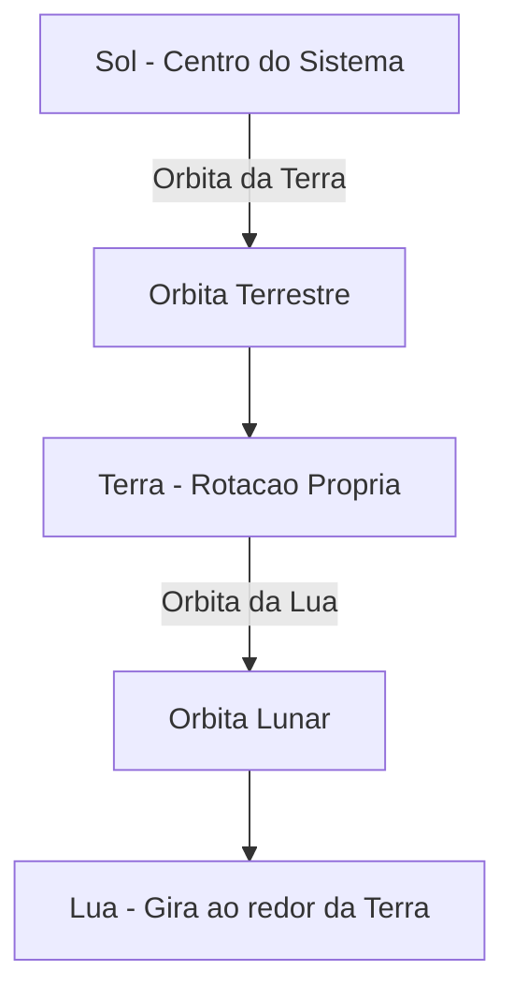

O arquivo [`HierarchicalModeling.cs`](https://github.com/Gabriel-Freitas-S/CGPDI.StudyLab/blob/main/CGPDI.StudyLab/Graphics3D/HierarchicalModeling.cs) implementa o robô articulado e a simulação orbital.

---

## 1. Braço Robótico Articulado (4 Graus de Liberdade)

Na interface (aba **Computação Gráfica 3D** $\to$ **Modelagem Hierárquica**), você controla 4 juntas mecânicas com limites realistas:

| Junta | Eixo | Limites Angulares | Movimento |
| :--- | :--- | :--- | :--- |
| **Base** | Eixo $Y$ | $-180^\circ$ a $+180^\circ$ | Gira todo o conjunto ao redor da base fixa. |
| **Ombro** | Eixo $Z$ | $-60^\circ$ a $+60^\circ$ | Inclina o braço principal. |
| **Cotovelo** | Eixo $Z$ | $-90^\circ$ a $+90^\circ$ | Dobra o antebraço. |
| **Pulso** | Eixo $X$ | $-90^\circ$ a $+90^\circ$ | Rotaciona as garras. |

---

## 2. O Sistema Planetário Hierárquico

- A Terra apenas calcula seu movimento ao redor do Sol.
- A Lua apenas calcula seu movimento ao redor da Terra.
- Quando a Terra viaja pelo espaço, a Lua é automaticamente transportada junto, mantendo sua órbita perfeitamente sincronizada.

---

👉 **Próximo Passo:** Entre no módulo de [Ray Tracing & Renderização Realística](/raytracing/fundamentos-e-fisica-da-luz/).
