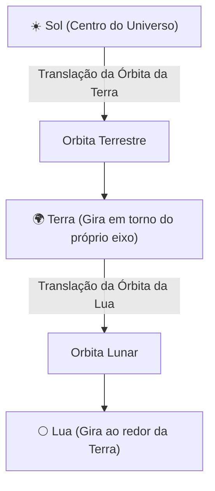

O arquivo [`HierarchicalModeling.cs`](https://github.com/Gabriel-Freitas-S/CGPDI.StudyLab/blob/main/CGPDI.StudyLab/Graphics3D/HierarchicalModeling.cs) implementa dois modelos interativos completos para estudo prático da Unidade 3.

---

## 🦾 1. O Braço Robótico Articulado (4 Graus de Liberdade - 4-DOF)

O modelo do robô é montado através de cilindros e caixas conectados nas articulações:

```
[ Base Giratória (Eixo Y) ]
           |
     [ Junta Ombro ]
           |
     [ Braço Principal ]
           |
    [ Junta Cotovelo ]
           |
      [ Antebraço ]
           |
     [ Junta Pulso ]
           |
     [ Garras Duplas ]
```

### Controles Interativos e Limites Angulares:
Na interface do aplicativo (aba **🧊 Computação Gráfica 3D** $\to$ Seção **Modelagem Hierárquica**), você encontra 4 sliders com limites mecânicos realistas:

| Junta / Articulação | Eixo de Rotação | Limites Angulares | Efeito Físico |
| :--- | :--- | :--- | :--- |
| **Giro da Base** | Eixo $Y$ (Vertical) | $-180^\circ$ a $+180^\circ$ | Gira todo o robô ao redor da base fixa. |
| **Ombro (Shoulder)** | Eixo $Z$ | $-60^\circ$ a $+60^\circ$ | Inclina o braço para frente e para trás. |
| **Cotovelo (Elbow)** | Eixo $Z$ | $-90^\circ$ a $+90^\circ$ | Dobra o antebraço. |
| **Pulso (Wrist)** | Eixo $X$ | $-90^\circ$ a $+90^\circ$ | Rotaciona a ferramenta de garra. |

```csharp
// Atualização das juntas no HierarchicalModeling.cs:
public void SetJointAngles(double baseDeg, double shoulderDeg, double elbowDeg, double wristDeg)
{
    _baseRotation.Angle = baseDeg;
    _shoulderRotation.Angle = shoulderDeg;
    _elbowRotation.Angle = elbowDeg;
    _wristRotation.Angle = wristDeg;
}
```

---

## ☀️ 2. O Sistema Planetário Hierárquico

Outro exemplo clássico de hierarquia espacial é o sistema solar:



### Por que a hierarquia simplifica o cálculo?
- A **Terra** só precisa saber sua distância até o Sol e seu ângulo de translação.
- A **Lua** só precisa saber sua distância até a Terra e seu ângulo relativo à Terra.
- Quando a Terra se move ao redor do Sol, **a Lua é automaticamente transportada junto**, orbitando a Terra de forma contínua sem que a Lua precise saber onde o Sol está!

---

👉 **Próximo Passo:** Entre no fascinante mundo do [Ray Tracing & Renderização Realística](/CGPDI.StudyLab/raytracing/fundamentos-e-fisica-da-luz/).
