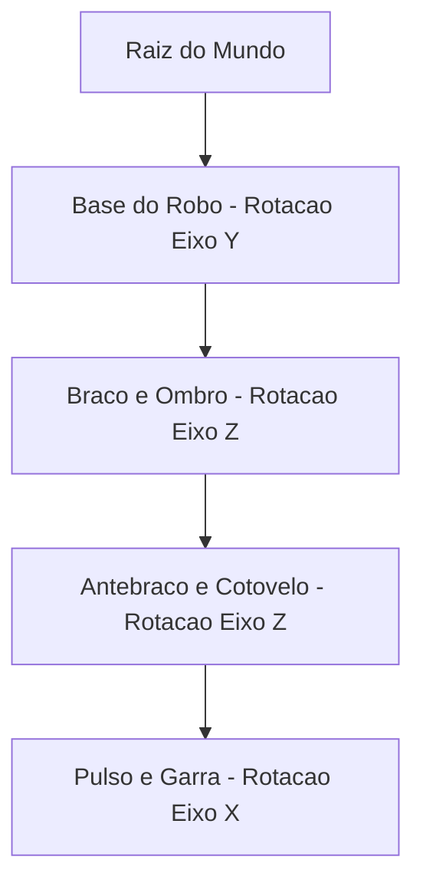

A **Modelagem Hierárquica** é o tema central da **Unidade 3 do Plano de Ensino**.

Ela resolve um desafio clássico: como movimentar objetos articulados (como braços robóticos, portas de carros e personagens) sem precisar calcular manualmente a posição global de cada pedaço.

O arquivo [`HierarchicalModeling.cs`](https://github.com/Gabriel-Freitas-S/CGPDI.StudyLab/blob/main/CGPDI.StudyLab/Graphics3D/HierarchicalModeling.cs) implementa a árvore do Grafo de Cena (*Scene Graph*).

---

## 1. O que é um Grafo de Cena (Scene Graph)?

### A Analogia do Esqueleto Humano:
Quando você levanta o seu ombro, o seu braço, o seu cotovelo, o seu pulso e os seus dedos sobem juntos automaticamente. Você não precisa pensar em levantar cada dedo separadamente porque eles estão conectados em uma cadeia hierárquica.

---

## 2. Propagação Matricial Pai-Filho

A matriz de qualquer nó filho no mundo $M_{\text{global, filho}}$ é o produto da matriz do pai pela sua própria matriz local:

$$
M_{\text{global, filho}} = M_{\text{global, pai}} \times M_{\text{local, filho}}
$$

A cadeia cinemática completa do robô:
$$
M_{\text{garra}} = T_{\text{base}} \times R_y(\theta_{\text{base}}) \times T_{\text{ombro}} \times R_z(\theta_{\text{ombro}}) \times T_{\text{cotovelo}} \times R_z(\theta_{\text{cotovelo}}) \times R_x(\theta_{\text{pulso}})
$$

---

👉 **Próximo Passo:** Veja o [Braço Robótico e o Sistema Solar em Execução](/hierarquia/braco-robotico-e-animacoes/).
