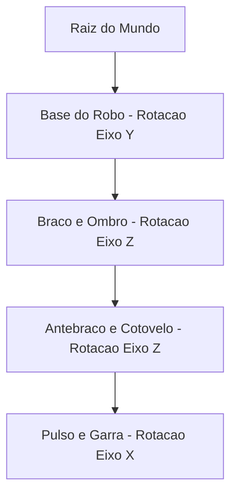

A **Modelagem Hierárquica** é essencial para a animação e montagem de estruturas articuladas complexas (como braços robóticos, animais quadrúpedes e veículos).

Ela resolve um desafio clássico: como movimentar objetos interconectados sem precisar calcular manualmente a posição global absoluta de cada subcomponente.

O arquivo [`HierarchicalModeling.cs`](https://github.com/Gabriel-Freitas-S/CGPDI.StudyLab/blob/main/CGPDI.StudyLab/Graphics3D/HierarchicalModeling.cs) implementa a árvore do Grafo de Cena (*Scene Graph*) e o WPF utiliza nós `Model3DGroup` com transformações aninhadas.

---

## 1. O que é um Grafo de Cena (Scene Graph)?

### A Analogia da Cadeia Cinemática:
Quando o ombro de um personagem se move, o braço, o antebraço, a mão e os dedos acompanham o movimento automaticamente, porque pertencem à mesma subárvore hierárquica.

---

## 2. Metodologia: Top-Down vs Bottom-Up

1. **Design Top-Down (Análise Estrutural):**
   - O objeto complexo é decomposto em subsistemas hierárquicos.
   - Identificam-se os eixos e pivôs onde o movimento articular ocorre.
2. **Construção Bottom-Up (Montagem Prática):**
   - Inicia-se pela criação dos **componentes primitivos** (geometrias básicas na origem com `MeshGeometry3D`).
   - Agrupam-se os primitivos em **componentes agrupadores** (`Model3DGroup`) com transformações de instância e junta.

---

## 3. Transformação de Instância vs Transformação de Junta

- **Transformação de Instância:** Posiciona e orienta estaticamente o componente em relação ao seu nó pai (ex: afastar a pata $1.5$ unidades para a direita do tronco).
- **Transformação de Junta:** Aplica a rotação dinâmica parametrizada pelo tempo em torno do eixo de articulação (ex: rotação periódica da coxa em torno do quadril).

### Propagação Matricial Pai-Filho
A matriz global de qualquer nó filho no mundo $M_{\text{global, filho}}$ é o produto da matriz acumulada do pai pela sua matriz de junta e instância:

$$
M_{\text{global, filho}} = M_{\text{global, pai}} \times M_{\text{instancia}} \times M_{\text{junta}}(t)
$$

---

## 4. Cinemática Harmônica de Marcha em Quadrúpedes

Para simular o ciclo de caminhada de um animal ou robô de 4 patas, aplicam-se funções harmônicas com defasagem angular constante entre os membros:

$$
\begin{aligned}
\theta_{\text{dianteira, esq}}(t) &= A \cdot \sin(\omega t) \\
\theta_{\text{dianteira, dir}}(t) &= A \cdot \sin(\omega t + \pi) \\
\theta_{\text{traseira, esq}}(t) &= A \cdot \sin(\omega t + \pi/2) \\
\theta_{\text{traseira, dir}}(t) &= A \cdot \sin(\omega t + 3\pi/2)
\end{aligned}
$$

Essa defasagem de $90^\circ$ e $180^\circ$ garante que as 4 patas alternem os apoios no solo de maneira fisicamente natural e contínua.

---

  <h4>Referências Oficiais Microsoft Learn</h4>
  <ul>
    <li><a href="https://learn.microsoft.com/pt-br/dotnet/api/system.windows.media.media3d.model3dgroup" target="_blank" rel="noopener">Classe Model3DGroup (System.Windows.Media.Media3D)</a> — Coleção de nós tridimensionais em árvore com transformações compostas.</li>
    <li><a href="https://learn.microsoft.com/pt-br/dotnet/api/system.windows.media.media3d.rotatetransform3d" target="_blank" rel="noopener">Classe RotateTransform3D</a> — Aplicação de rotações em eixos 3D com pivô customizado.</li>
  </ul>

---

**Próximo Passo:** Veja o [Braço Robótico e o Sistema Solar em Execução](/hierarquia/braco-robotico-e-animacoes/).
