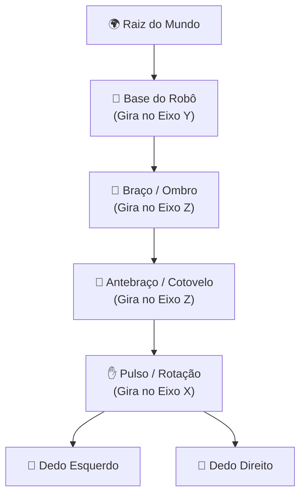

A **Modelagem Hierárquica** é o tema central da **Unidade 3 do Plano de Ensino Universitário**.

Ela resolve um dos problemas mais complexos da Computação Gráfica: como modelar e animar objetos articulados complexos (como robôs industriais, veículos com rodas giratórias, personagens humanos ou o sistema solar) sem ter que recalcular manualmente a posição trigonométrica de cada parafuso no espaço global do mundo.

O arquivo [`HierarchicalModeling.cs`](https://github.com/Gabriel-Freitas-S/CGPDI.StudyLab/blob/main/CGPDI.StudyLab/Graphics3D/HierarchicalModeling.cs) implementa a estrutura de Grafo de Cena (*Scene Graph*).

---

## 🌳 1. O que é um Grafo de Cena (Scene Graph)?

Um **Grafo de Cena** é uma estrutura de dados em árvore onde:
- Cada **Nó (Node)** representa uma parte articulada do objeto ou subsistema;
- Cada nó possui sua própria **Transformação Local** (translação, rotação, escala em relação ao seu nó pai);
- Os nós filhos **herdam automaticamente** todas as transformações de seus nós ancestrais.



---

## 🧮 2. A Matemática da Propagação de Matrizes

A matriz de transformação global no mundo de qualquer nó filho $M_{\text{global, filho}}$ é o produto da matriz global do pai pela sua própria matriz local:

$$
M_{\text{global, filho}} = M_{\text{global, pai}} \times M_{\text{local, filho}}
$$

### A Cadeia Cinemática de 4 Níveis do Braço Robótico:
Para calcular a posição exata da garra no mundo:

$$
M_{\text{garra}} = T_{\text{base}} \times R_y(\theta_{\text{base}}) \times T_{\text{ombro}} \times R_z(\theta_{\text{ombro}}) \times T_{\text{cotovelo}} \times R_z(\theta_{\text{cotovelo}}) \times R_x(\theta_{\text{pulso}})
$$

:::tip[Por que isso é revolucionário?]
Se você girar a base do robô em $45^\circ$, o ombro, o cotovelo, o pulso e as garras giram juntos instantaneamente sem nenhuma linha de código adicional, pois o subsistema de matrizes propaga a rotação para baixo na árvore!
:::

---

## 📐 3. Design Top-Down vs Construção Bottom-Up

O Plano de Ensino destaca duas filosofias complementares:

1. **Design Top-Down (De Cima para Baixo):**
   - Planeja a estrutura lógica do sistema: "O robô tem uma base $\to$ que conecta um braço $\to$ que sustenta o antebraço $\to$ que segura a ferramenta".
2. **Construção Bottom-Up (De Baixo para Cima):**
   - Cria as peças primitivas 3D individuais (cilindros, caixas, esferas) com dimensões normalizadas e depois as conecta hierarquicamente nas juntas articuladas.

---

## 💻 4. Implementação do Nó (`SceneNode3D`)

```csharp
public class SceneNode3D
{
    public string Name { get; set; }
    public Model3DGroup ModelGroup { get; } = new Model3DGroup();
    public Transform3DGroup TransformGroup { get; } = new Transform3DGroup();
    public List<SceneNode3D> Children { get; } = new List<SceneNode3D>();

    public SceneNode3D(string name)
    {
        Name = name;
        ModelGroup.Transform = TransformGroup;
    }

    public void AddChild(SceneNode3D child)
    {
        Children.Add(child);
        ModelGroup.Children.Add(child.ModelGroup); // Herança de transformações!
    }

    public void AddGeometry(GeometryModel3D model)
    {
        ModelGroup.Children.Add(model);
    }
}
```

---

👉 **Próximo Passo:** Veja o [Braço Robótico e o Sistema Solar em Execução](/CGPDI.StudyLab/hierarquia/braco-robotico-e-animacoes/).
