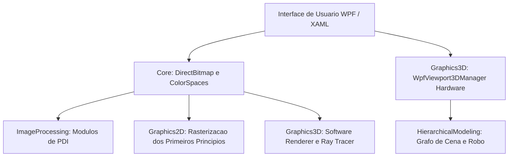

import { CardGrid, LinkCard, Tabs, TabItem } from '@astrojs/starlight/components';

## Download Oficial do Aplicativo

Baixe a versão mais recente do **CGPDI StudyLab** para Windows 10/11:

<CardGrid>
  <LinkCard
    title="Instalador Oficial Velopack (.exe)"
    description="Instalação recomendada com tela splash Dark Slate, atalhos na Área de Trabalho e Menu Iniciar e atualizações delta ultrarrápidas."
    href="https://github.com/Gabriel-Freitas-S/CGPDI.StudyLab/releases/latest/download/CGPDIStudyLab-win-Setup.exe"
  />
  <LinkCard
    title="Instalador Corporativo Machine-Wide (.msi)"
    description="Pacote Windows Installer (.msi) personalizado para implantação em massa por administradores e laboratórios universitários."
    href="https://github.com/Gabriel-Freitas-S/CGPDI.StudyLab/releases/latest/download/CGPDI-StudyLab-MachineWide.msi"
  />
  <LinkCard
    title="Pacote Portátil Zero-Admin (.zip)"
    description="Arquivo compactado contendo o executável autônomo e instruções. Roda direto de pendrives sem exigir direitos de administrador."
    href="https://github.com/Gabriel-Freitas-S/CGPDI.StudyLab/releases/latest/download/CGPDI-StudyLab-Portable-win-x64.zip"
  />
  <LinkCard
    title="Histórico de Releases e Changelogs"
    description="Consulte todas as versões lançadas, notas de atualização delta e código-fonte no GitHub Releases oficial."
    href="https://github.com/Gabriel-Freitas-S/CGPDI.StudyLab/releases/latest"
  />
</CardGrid>

---

## Interface do Aplicativo

Veja abaixo uma demonstração animada e os screenshots reais de cada módulo, capturados automaticamente a cada atualização via GitHub Actions.

  
  
⬆️ GIF atualizado automaticamente pelo CI a cada push

<Tabs>
  <TabItem label="🖼️ PDI">
    
    **Laboratório PDI** — Mais de 20 filtros espaciais (Sobel, Canny, Laplace), equalização de histograma, morfologia matemática e transformações geométricas. Resultados em tempo real com `DirectBitmap`.
  </TabItem>
  <TabItem label="✏️ 2D">
    
    **Computação Gráfica 2D** — Algoritmos de reta (DDA, Bresenham, Wu), círculos, curvas de Bézier e transformações afins 3×3 em coordenadas homogêneas.
  </TabItem>
  <TabItem label="🧊 3D">
    
    **Computação Gráfica 3D** — Pipeline MVP completo, renderizador em software (CPU + Z-Buffer) e Viewport3D acelerado por DirectX. Modelagem hierárquica de robôs articulados.
  </TabItem>
  <TabItem label="💡 Ray Tracing">
    
    **Ray Tracing** — Simulação física da luz: interseção analítica raio-esfera/plano, sombreamento Phong, sombras nítidas e refração pela Lei de Snell.
  </TabItem>
  <TabItem label="📚 Central de Estudos">
    
    **Central de Estudos** — Teoria completa com fórmulas renderizadas por LaTeX, quizzes de fixação, código C# comentado e complexidade computacional por algoritmo.
  </TabItem>
  <TabItem label="⚗️ Laboratório">
    
    **Laboratório de Código** — Editor C# ao vivo com compilação Roslyn em tempo real, testes unitários automatizados e gabarito oficial com 1 clique.
  </TabItem>
  <TabItem label="🎨 Estúdio">
    
    **Estúdio de Projetos** — Janela independente maximizável com suporte a múltiplos monitores, layout retrátil (trilha, editor e canvas) e modo foco.
  </TabItem>
</Tabs>

---

## Visão Geral dos Módulos

Esta documentação foi elaborada com foco na clareza pedagógica: conceitos matemáticos complexos são apresentados por meio de analogias intuitivas do dia a dia, acompanhados da fundamentação teórica rigorosa e do código-fonte comentado em C#.

<CardGrid>
  <LinkCard
    title="Fluxo de Desenvolvimento & Ferramentas"
    description="Entenda o ecossistema completo (.NET 10, WPF, Roslyn, Velopack, WiX, SonarQube, Snyk, Graphify) e o ciclo de vida da aplicação."
    href="/arquitetura/fluxo-de-desenvolvimento-e-ferramentas/"
  />
  <LinkCard
    title="Estúdio de Código e Compilador Roslyn"
    description="Escreva código C# e veja a compilação ao vivo atualizar o Canvas e a memória RAM em tempo real. Janela dedicada com Modo Foco e testes unitários."
    href="/iniciantes/modo-interativo-e-playground/"
  />
  <LinkCard
    title="1. Guia para Iniciantes (12 Lições C#)"
    description="Trilha de aprendizado cobrindo desde tipos primitivos (byte, uint), ponteiros unsafe, Data Binding reativo até Ray Tracing."
    href="/iniciantes/o-que-e-dotnet-csharp/"
  />
  <LinkCard
    title="2. Processamento Digital de Imagens (PDI)"
    description="Espaços de cor (RGB, HSV, YCbCr), convoluções espaciais, detector Canny de 5 etapas, morfologia matemática e Fourier 2D."
    href="/pdi/operacoes-pontuais-e-histogramas/"
  />
  <LinkCard
    title="3. Rasterização 2D (Primeiros Princípios)"
    description="Como as GPUs desenham: reta de Bresenham inteira, suavização Xiaolin Wu, círculo do ponto médio e matrizes afins 3×3."
    href="/cg2d/algebra-linear-e-matrizes/"
  />
  <LinkCard
    title="4. Computação Gráfica 3D e Pipeline"
    description="A trajetória do vértice 3D até a tela: matrizes MVP, renderizador em software na CPU com Z-Buffer e Viewport3D DirectX."
    href="/cg3d/matematica-vetorial-e-mvp/"
  />
  <LinkCard
    title="5. Modelagem Hierárquica (Cinemática)"
    description="Grafos de cena para robôs articulados e sistema solar com propagação matricial em cadeia pai-filho e cinemática direta."
    href="/hierarquia/grafos-de-cena-e-teoria/"
  />
  <LinkCard
    title="6. Ray Tracing Fotorrealista"
    description="Simulação física da luz: cálculo analítico de interseção raio-esfera, modelo Phong, sombras nítidas e refração com a Lei de Snell."
    href="/raytracing/fundamentos-e-fisica-da-luz/"
  />
  <LinkCard
    title="7. Arquitetura do Software e DirectX Tier"
    description="Desacoplamento de camadas, subsistema milcore, ponteiros não gerenciados e aceleração de hardware Direct3D Tier 2."
    href="/arquitetura/visao-geral/"
  />
</CardGrid>

---

## Estrutura dos Módulos do Sistema

O projeto [`CGPDI.StudyLab`](https://github.com/Gabriel-Freitas-S/CGPDI.StudyLab) é composto por módulos desacoplados e estruturados:

---

## Roteiro de Leitura Recomendado

1. **Para quem está começando:** Inicie por [O que é C#, .NET e WPF?](/iniciantes/o-que-e-dotnet-csharp/) e veja o [Modo Interativo & Playground](/iniciantes/modo-interativo-e-playground/).
2. **Para laboratórios de faculdade e TI:** Consulte o [Cenário Universitário & Zero-Admin](/iniciantes/cenario-universitario-sem-admin/) para aprender como instalar para todos os usuários e atualizar sem precisar de administrador.
3. **Para quem deseja entender a engenharia do projeto:** Consulte a [Visão Geral da Arquitetura](/arquitetura/visao-geral/) e os [Fundamentos de Memória & DirectBitmap](/core/fundamentos-de-memoria/).
4. **Para estudantes universitários:** Consulte o [Mapeamento do Plano de Ensino](/academico/mapeamento-do-plano/) para encontrar os conteúdos correspondentes aos trabalhos práticos (T1, T2 e T3).

---

## Referências Oficiais da Microsoft Learn

Esta documentação substitui a antiga Wiki do projeto, reunindo todo o conteúdo pedagógico e técnico em um único lugar. Aprofunde-se nos temas com a documentação oficial da Microsoft:

  <h4>Portais e Referências Recomendadas</h4>
  <ul>
    <li><a href="https://learn.microsoft.com/pt-br/dotnet/" target="_blank" rel="noopener">Documentação Oficial do .NET</a> — Guia geral da plataforma, bibliotecas e APIs.</li>
    <li><a href="https://learn.microsoft.com/pt-br/dotnet/csharp/language-reference/unsafe-code" target="_blank" rel="noopener">Tipos de Ponteiro e Código Não Seguro (unsafe) no C#</a> — Sintaxe de <code>fixed</code>, <code>stackalloc</code> e aritmética de ponteiros.</li>
    <li><a href="https://learn.microsoft.com/pt-br/dotnet/api/system.windows.media.imaging.writeablebitmap" target="_blank" rel="noopener">Classe WriteableBitmap e Formatos de Pixel no WPF</a> — Manipulação direta do buffer gráfico da GPU.</li>
    <li><a href="https://learn.microsoft.com/pt-br/dotnet/desktop/wpf/graphics-multimedia/3-d-graphics-overview" target="_blank" rel="noopener">Visão Geral de Gráficos 3D e Transformações no WPF</a> — Modelo 3D do WPF, câmeras e iluminação.</li>
    <li><a href="https://learn.microsoft.com/pt-br/dotnet/standard/parallel-programming/how-to-write-a-simple-parallel-for-loop" target="_blank" rel="noopener">Paralelismo de Dados com Parallel.For (TPL)</a> — Distribuição de carga em múltiplos núcleos de CPU.</li>
    <li><a href="https://learn.microsoft.com/pt-br/dotnet/api/system.numerics" target="_blank" rel="noopener">Namespace System.Numerics (SIMD)</a> — Operações vetoriais e matemáticas aceleradas por hardware.</li>
  </ul>

