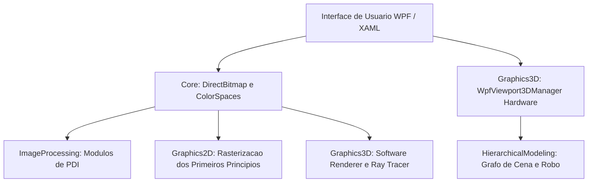

import { Card, CardGrid } from '@astrojs/starlight/components';

## Visão Geral dos Módulos

Esta documentação foi elaborada com foco na clareza pedagógica: conceitos matemáticos complexos são apresentados por meio de analogias intuitivas do dia a dia, acompanhados da fundamentação teórica rigorosa e do código-fonte comentado em C#.

<CardGrid stagger>
  <Card title="1. Guia para Iniciantes" icon="rocket">
    Introdução ao C#, funcionamento do .NET 10, instalação do Visual Studio passo a passo, compilação em um clique e depuração com pontos de interrupção (breakpoints).
  </Card>
  <Card title="2. Processamento Digital de Imagens (PDI)" icon="puzzle">
    Espaços de cor (RGB, HSV, YCbCr), convoluções espaciais, detector Canny de 5 etapas, morfologia matemática (Otsu), transformações geométricas e Transformada de Fourier 2D.
  </Card>
  <Card title="3. Rasterização 2D (Primeiros Princípios)" icon="pencil">
    Como as placas de vídeo desenham formas geométricas: reta de Bresenham em números inteiros, suavização de Xiaolin Wu, círculo do ponto médio e preenchimento de polígonos.
  </Card>
  <Card title="4. Computação Gráfica 3D & Pipeline" icon="laptop">
    A trajetória do vértice 3D até a tela 2D: matrizes MVP, renderizador em software na CPU com Z-Buffer baricêntrico e Viewport3D com aceleração DirectX.
  </Card>
  <Card title="5. Modelagem Hierárquica & Cinemática" icon="setting">
    Grafos de cena (Scene Graph), acumulação de matrizes pai-filho e controle de robô articulado com cinemática direta e limites de rotação.
  </Card>
  <Card title="6. Ray Tracing Fotorrealista" icon="star">
    Simulação física da trajetória da luz: cálculo analítico de interseção raio-esfera, sombras nítidas, reflexões recursivas e refração com a Lei de Snell e Fresnel.
  </Card>
</CardGrid>

---

## Estrutura dos Módulos do Sistema

O projeto [`CGPDI.StudyLab`](https://github.com/Gabriel-Freitas-S/CGPDI.StudyLab) é composto por módulos desacoplados e estruturados:

---

## Roteiro de Leitura Recomendado

1. **Para quem está começando:** Inicie por [O que é C#, .NET e WPF?](/CGPDI.StudyLab/iniciantes/o-que-e-dotnet-csharp/) e siga para o tutorial de [Instalação do Visual Studio](/CGPDI.StudyLab/iniciantes/instalacao-visual-studio/).
2. **Para quem deseja entender a engenharia do projeto:** Consulte a [Visão Geral da Arquitetura](/CGPDI.StudyLab/arquitetura/visao-geral/) e os [Fundamentos de Memória & DirectBitmap](/CGPDI.StudyLab/core/fundamentos-de-memoria/).
3. **Para estudantes universitários:** Consulte o [Mapeamento do Plano de Ensino](/CGPDI.StudyLab/academico/mapeamento-do-plano/) para encontrar os conteúdos correspondentes aos trabalhos práticos (T1, T2 e T3).
