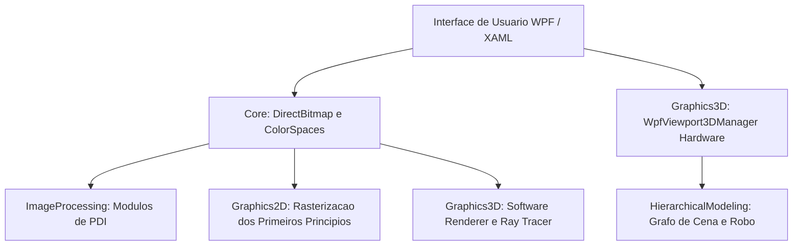

import { CardGrid, LinkCard } from '@astrojs/starlight/components';

## Visão Geral dos Módulos

Esta documentação foi elaborada com foco na clareza pedagógica: conceitos matemáticos complexos são apresentados por meio de analogias intuitivas do dia a dia, acompanhados da fundamentação teórica rigorosa e do código-fonte comentado em C#.

<CardGrid>
  <LinkCard
    title="🎓 Estúdio de Código & Compilador Roslyn"
    description="Escreva código C# e veja a compilação ao vivo atualizar o Canvas e a memória RAM em tempo real. Janela dedicada com Modo Foco e testes unitários."
    href="/CGPDI.StudyLab/iniciantes/modo-interativo-e-playground/"
  />
  <LinkCard
    title="🚀 1. Guia para Iniciantes (12 Lições C#)"
    description="Trilha de aprendizado cobrindo desde tipos primitivos (byte, uint), ponteiros unsafe, Data Binding reativo até Ray Tracing."
    href="/CGPDI.StudyLab/iniciantes/o-que-e-dotnet-csharp/"
  />
  <LinkCard
    title="🖼️ 2. Processamento Digital de Imagens (PDI)"
    description="Espaços de cor (RGB, HSV, YCbCr), convoluções espaciais, detector Canny de 5 etapas, morfologia matemática e Fourier 2D."
    href="/CGPDI.StudyLab/pdi/operacoes-pontuais-e-histogramas/"
  />
  <LinkCard
    title="✏️ 3. Rasterização 2D (Primeiros Princípios)"
    description="Como as GPUs desenham: reta de Bresenham inteira, suavização Xiaolin Wu, círculo do ponto médio e matrizes afins 3×3."
    href="/CGPDI.StudyLab/cg2d/algebra-linear-e-matrizes/"
  />
  <LinkCard
    title="📦 4. Computação Gráfica 3D & Pipeline"
    description="A trajetória do vértice 3D até a tela: matrizes MVP, renderizador em software na CPU com Z-Buffer e Viewport3D DirectX."
    href="/CGPDI.StudyLab/cg3d/matematica-vetorial-e-mvp/"
  />
  <LinkCard
    title="🤖 5. Modelagem Hierárquica (Cinemática)"
    description="Grafos de cena para robôs articulados e sistema solar com propagação matricial em cadeia pai-filho e cinemática direta."
    href="/CGPDI.StudyLab/hierarquia/grafos-de-cena-e-teoria/"
  />
  <LinkCard
    title="🌟 6. Ray Tracing Fotorrealista"
    description="Simulação física da luz: cálculo analítico de interseção raio-esfera, modelo Phong, sombras nítidas e refração com a Lei de Snell."
    href="/CGPDI.StudyLab/raytracing/fundamentos-e-fisica-da-luz/"
  />
  <LinkCard
    title="🏛️ 7. Arquitetura do Software & DirectX Tier"
    description="Desacoplamento de camadas, subsistema milcore, ponteiros não gerenciados e aceleração de hardware Direct3D Tier 2."
    href="/CGPDI.StudyLab/arquitetura/visao-geral/"
  />
</CardGrid>

---

## Estrutura dos Módulos do Sistema

O projeto [`CGPDI.StudyLab`](https://github.com/Gabriel-Freitas-S/CGPDI.StudyLab) é composto por módulos desacoplados e estruturados:

---

## Roteiro de Leitura Recomendado

1. **Para quem está começando:** Inicie por [O que é C#, .NET e WPF?](/CGPDI.StudyLab/iniciantes/o-que-e-dotnet-csharp/) e siga para o tutorial de [Instalação do Visual Studio](/CGPDI.StudyLab/iniciantes/instalacao-visual-studio/).
2. **Para quem deseja entender a engenharia do projeto:** Consulte a [Visão Geral da Arquitetura](/CGPDI.StudyLab/arquitetura/visao-geral/) e os [Fundamentos de Memória & DirectBitmap](/CGPDI.StudyLab/core/fundamentos-de-memoria/).
3. **Para estudantes universitários:** Consulte o [Mapeamento do Plano de Ensino](/CGPDI.StudyLab/academico/mapeamento-do-plano/) para encontrar os conteúdos correspondentes aos trabalhos práticos (T1, T2 e T3).
