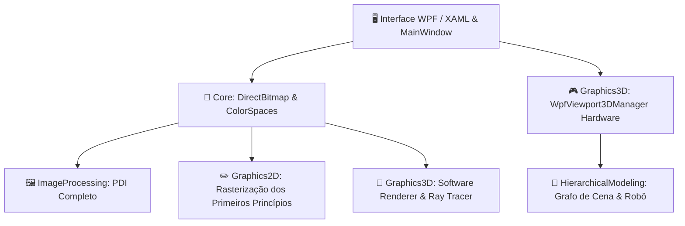

import { Card, CardGrid } from '@astrojs/starlight/components';

## 🎯 O Que Você Vai Aprender Nesta Wiki?

Esta documentação foi projetada desde a raiz tanto para **iniciantes absolutos** (que nunca programaram em C#, não conhecem o ecossistema .NET e nunca abriram o Visual Studio) quanto para **estudantes de Ciência e Engenharia da Computação** que buscam aprofundamento rigoroso na matemática e nos algoritmos da Computação Gráfica.

<CardGrid stagger>
  <Card title="🚀 1. Guia para Iniciantes Absolutos" icon="rocket">
    Aprenda o que é C#, como funciona o .NET 10, como instalar o Visual Studio passo a passo, compilar com 1 clique e depurar usando Breakpoints.
  </Card>
  <Card title="🖼️ 2. Processamento Digital de Imagens (PDI)" icon="puzzle">
    Dezenas de algoritmos: Espaços de cor (RGB, HSV, YCbCr), Convoluções 2D, Detecção Canny em 5 etapas, Morfologia Matemática (Otsu), Transformações Geométricas e Transformada de Fourier 2D (DFT).
  </Card>
  <Card title="✏️ 3. Rasterização 2D (Primeiros Princípios)" icon="pencil">
    Como placas de vídeo desenham: Reta de Bresenham em aritmética inteira, Anti-Aliasing de Xiaolin Wu, Círculos/Elipses do Ponto Médio, Curvas de Bézier e Scanline Fill.
  </Card>
  <Card title="🧊 4. Computação Gráfica 3D & Pipeline" icon="laptop">
    A jornada matemática do vértice 3D até a tela 2D: Álgebra Linear MVP, Renderizador CPU em Software com Z-Buffer baricêntrico e Viewport3D acelerado por DirectX.
  </Card>
  <Card title="🤖 5. Modelagem Hierárquica & Cinemática" icon="setting">
    Grafos de cena (Scene Graph), acumulação de matrizes pai-filho e controle de robô articulado com cinemática direta e limites angulares.
  </Card>
  <Card title="⚡ 6. Ray Tracing Fotorrealista" icon="star">
    Simulação física de transporte de radiação de luz: Interseções analíticas raio-esfera, sombras nítidas, reflexões recursivas e refração com a Lei de Snell e Fresnel.
  </Card>
</CardGrid>

---

## 🏛️ Mapa dos Módulos do Sistema

O projeto [`CGPDI.StudyLab`](https://github.com/Gabriel-Freitas-S/CGPDI.StudyLab) está dividido em módulos bem organizados e independentes:

---

## 💡 Por Onde Devo Começar?

1. **Se você nunca usou C# ou Visual Studio:** Comece por [O que é C#, .NET e WPF?](/CGPDI.StudyLab/iniciantes/o-que-e-dotnet-csharp/) e siga para o tutorial de [Instalação do Visual Studio](/CGPDI.StudyLab/iniciantes/instalacao-visual-studio/).
2. **Se você já sabe programar e quer entender como o projeto funciona:** Leia a [Visão Geral da Arquitetura](/CGPDI.StudyLab/arquitetura/visao-geral/) e [Fundamentos de Memória & DirectBitmap](/CGPDI.StudyLab/core/fundamentos-de-memoria/).
3. **Se você é estudante seguindo o Plano de Ensino:** Acesse o [Mapeamento do Plano de Ensino](/CGPDI.StudyLab/academico/mapeamento-do-plano/) para encontrar a teoria exata de cada avaliação (T1, T2 e T3).
