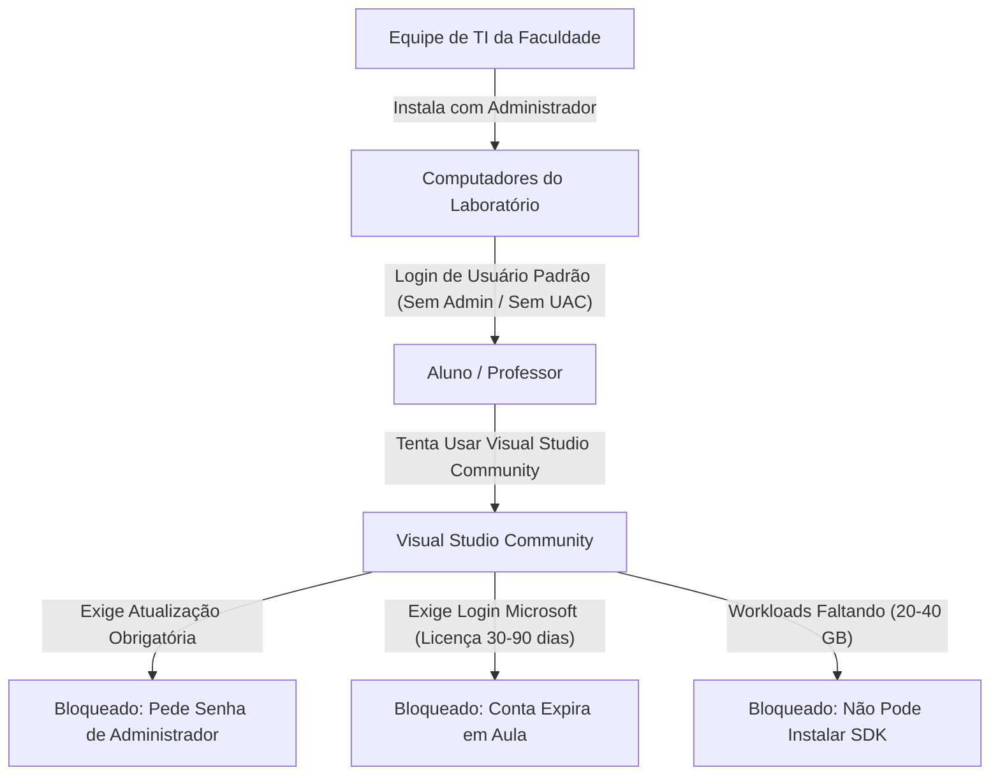
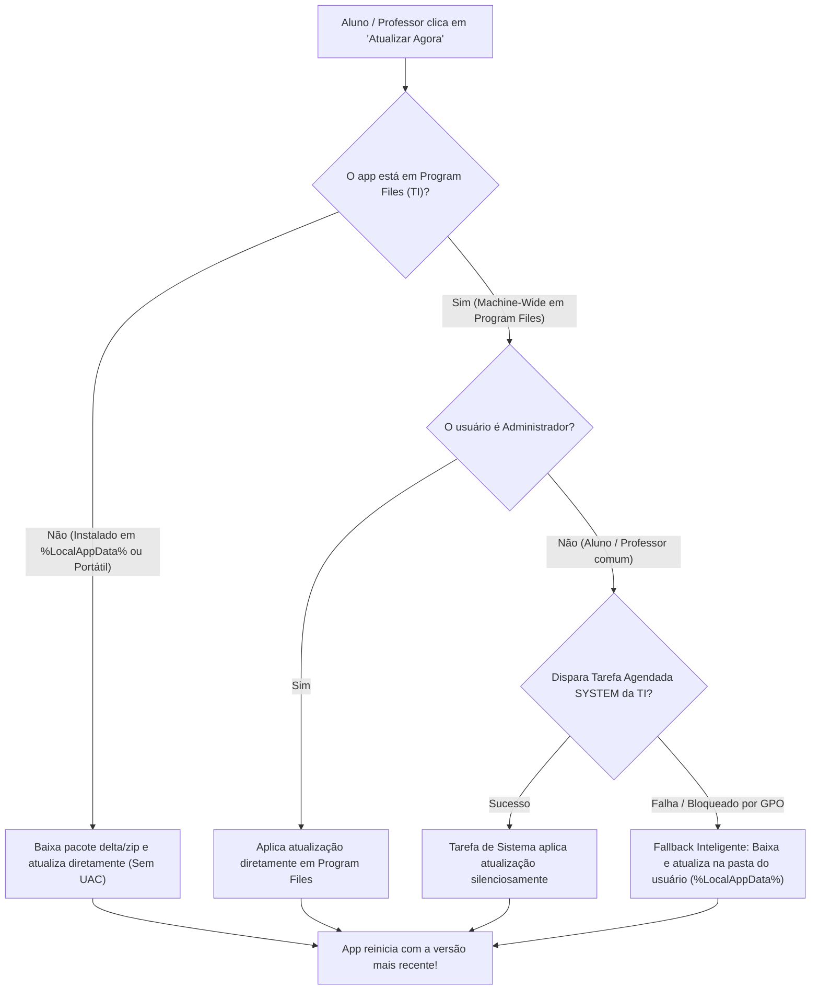

import { Tabs, TabItem, Card, CardGrid, Badge } from '@astrojs/starlight/components';

Em laboratórios de informática universitários, estudantes e professores frequentemente enfrentam barreiras técnicas que paralisam o aprendizado prático. Esta página explica como o **CGPDI StudyLab** foi arquitetado especificamente para eliminar essas fricções, garantindo autonomia pedagógica sem violar as políticas de segurança da Tecnologia da Informação (TI).

---

## O Problema: Por que o Visual Studio Community Gera Fricção nos Laboratórios?

Em quase todas as faculdades e universidades, a infraestrutura segue um modelo de contas de usuário restritas:



### Principais Dores Enfrentadas por Professores e Alunos:
1. **Bloqueio por Atualizações Pendentes:** O Visual Studio Community com frequência bloqueia a compilação ou exige atualizações de componentes críticos. Como os alunos não possuem a senha de administrador da máquina, a aula prática é interrompida.
2. **Expiração de Licença / Login Microsoft:** A cada 30 a 90 dias, o VS Community exige renovação de login com conta institucional/pessoal, o que falha em máquinas compartilhadas de laboratório com perfis temporários.
3. **Instalações Pesadas e Rígidas:** O Visual Studio completo exige entre 20 GB e 50 GB de espaço em disco e dezenas de cargas de trabalho (*workloads*).
4. **Dependência Excessiva de Chamados de TI:** Qualquer ajuste no ambiente exige abertura de chamados que podem demorar dias para serem atendidos pela equipe de TI da instituição.

---

## A Solução do CGPDI StudyLab

O CGPDI StudyLab foi projetado com três pilares fundamentais de autonomia e flexibilidade:

<CardGrid>
  <Card title="1. Compilador C#/XAML Embutido (Zero-VS)" icon="seti:c-sharp">
    Possui o compilador **Roslyn C# Scripting** e o motor gráfico **DirectBitmap** integrados. Alunos e professores **não precisam do Visual Studio instalado** na máquina para programar, compilar shaders/filtros e ver a computação gráfica rodando a 60+ FPS em tempo real.
  </Card>
  <Card title="2. Atualização Inteligente Zero-Admin" icon="rocket">
    O aplicativo é capaz de se auto-atualizar sem exigir senha de administrador, utilizando uma **tarefa de sistema pré-autorizada (SYSTEM)** ou fazendo **fallback automático e transparente para a pasta local do usuário (`%LocalAppData%`)**.
  </Card>
  <Card title="3. Modo Portátil em Pendrive" icon="laptop">
    O software pode ser executado diretamente de um pendrive ou da pasta `Downloads` sem necessidade de qualquer instalação ou permissão especial, ideal para levar os estudos para casa e compartilhar com colegas.
  </Card>
</CardGrid>

---

## Modelos de Instalação Disponíveis

<Tabs>
  <TabItem label="Instalação Local (Aluno / Professor)">
    Ideal para instalar no computador pessoal ou na própria sessão de usuário do laboratório:
    
    1. Baixe o instalador executável **`CGPDIStudyLab-win-Setup.exe`** na [Página de Releases](https://github.com/Gabriel-Freitas-S/CGPDI.StudyLab/releases/latest).
    2. Dê duplo clique no instalador.
    3. O app será instalado instantaneamente em `%LocalAppData%\Programs\CGPDIStudyLab` **sem pedir privilégios de administrador ou senha de UAC**.
    4. Atalhos serão criados automaticamente na Área de Trabalho e no Menu Iniciar.
    5. As atualizações subsequentes ocorrerão via pacotes **delta** (geralmente menores que 5 MB) de forma 100% automática.
  </TabItem>

  <TabItem label="Implantação em Massa pela TI (Todos os Usuários)">
    Para equipes de TI que gerenciam 40+ máquinas em laboratórios via **GPO**, **Microsoft Intune**, **SCCM** ou scripts:

    1. Baixe o pacote **`CGPDI-StudyLab-MachineWide.msi`**.
    2. Execute a instalação silenciosa via linha de comando com privilégios de administrador:
       ```cmd
       msiexec /i CGPDI-StudyLab-MachineWide.msi /qn /norestart
       ```
    3. O aplicativo é instalado em `C:\Program Files\CGPDIStudyLab` e disponibilizado no perfil de todos os usuários (`Public Desktop` e `All Users Start Menu`).
    4. Durante a instalação, é registrada a tarefa agendada do sistema (`CGPDI StudyLab AutoUpdate`), permitindo que as atualizações ocorram sem necessidade de intervenção manual da TI a cada nova release.
  </TabItem>

  <TabItem label="Versão Portátil (Pendrive / Sem Instalação)">
    Para levar em pendrives ou usar em computadores com restrição total de instalação:

    1. Baixe o arquivo **`CGPDI-StudyLab-Portable-win-x64.zip`**.
    2. Extraia o conteúdo para qualquer pasta (ex.: seu pendrive `E:\CGPDI\` ou na sua pasta `Downloads`).
    3. Dê duplo clique em **`CGPDI.StudyLab.exe`**.
    4. O aplicativo roda imediatamente, com todas as 12 lições, compilador Roslyn e laboratórios de imagem prontos para uso.
  </TabItem>
</Tabs>

---

## Como Funciona a Atualização Sem Administrador (Zero-Admin)?

Quando um aluno ou professor clica em **"Atualizações"** na barra superior e solicita a atualização, o aplicativo adota um fluxo de resolução inteligente em camadas:



---

## Pesquisa de Segurança & Políticas de TI (Compliance)

Um dos pontos fundamentais para coordenadores de curso e administradores de rede é garantir que o mecanismo de atualização não represente riscos de segurança ou viole normas da instituição.

### 1. O serviço de atualização fere alguma política de segurança corporativa/acadêmica?
**Não.** O mecanismo segue rigorosamente as melhores práticas recomendadas pela Microsoft (*CIS Windows Benchmarks* e *NIST SP 800-53*):

| Princípio de Segurança | Como o CGPDI StudyLab Implementa | Veredito de Segurança |
| :--- | :--- | :--- |
| **Menor Privilégio (*Least Privilege*)** | A aplicação roda no contexto do usuário comum. Ela não eleva permissões arbitrárias nem altera arquivos protegidos do Windows. | **100% Conforme** |
| **Prevenção de Escalação de Privilégios** | A tarefa agendada do sistema (`CGPDI StudyLab AutoUpdate`) possui comando fixo e parâmetros imutáveis. O usuário não consegue injetar comandos arbitrários no processo de sistema. | **Protegido contra Privilege Escalation** |
| **Origem e Integridade dos Binários** | Todas as atualizações são baixadas exclusivamente via conexão segura **HTTPS (TLS 1.3)** do repositório oficial do GitHub Releases (`Gabriel-Freitas-S/CGPDI.StudyLab`), com validação rigorosa de hash e checksum dos pacotes. | **Autenticidade e Integridade Garantidas** |
| **Trilha de Auditoria (*Audit Logging*)** | O agendador do Windows e o sistema registram todas as ações no *Visualizador de Eventos* (*Windows Event Viewer -> TaskScheduler*), permitindo que a TI audite exatamente quando e o que foi atualizado. | **Totalmente Auditável** |
| **Compatibilidade com AppLocker / SRP** | Se a rede bloquear `%LocalAppData%`, a instalação machine-wide em `C:\Program Files` garante conformidade nativa com as regras de caminho e editor do AppLocker. | **Compatível com AppLocker** |

### 2. E se a faculdade precisar "congelar" a versão para dias de prova ou trabalhos avaliativos?
A equipe de TI ou o professor responsável podem optar por:
- **Desativar a verificação de atualizações:** No arquivo de configuração ou simplesmente mantendo as máquinas em versão fixa.
- **Gerenciamento Centralizado via MSI:** A TI pode gerenciar a versão das máquinas diretamente via Intune/GPO distribuindo o novo pacote `.msi` apenas no início do semestre letivo.

---

## Resumo dos Benefícios

1. **Para o Aluno:** Estuda em qualquer computador da faculdade ou em casa, sem travas, sem logins chatos e com atualizações em 1 clique.
2. **Para o Professor:** Não perde tempo de aula resolvendo problemas de instalação, SDKs desatualizados ou licenças expiradas do Visual Studio.
3. **Para a Equipe de TI:** Instalação limpa em massa via MSI, sem aumento de chamados de suporte técnico e com total conformidade de segurança.
