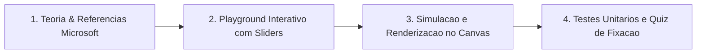
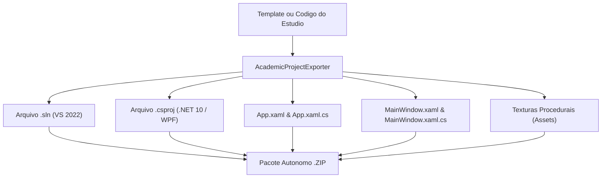

O **Laboratório Interativo (Aba 6)** e o **Estúdio de Projetos (Aba 7)** do [`CGPDI.StudyLab`](https://github.com/Gabriel-Freitas-S/CGPDI.StudyLab) foram desenvolvidos especialmente para estudantes e desenvolvedores que desejam **revisar C# moderno (.NET 10)**, compreender a arquitetura do **WPF (Windows Presentation Foundation)** e praticar conceitos de **Processamento Digital de Imagens e Computação Gráfica** através de experimentação manual, visual e código executável.

---

## Como Funciona a Trilha de Aprendizado

A esteira de estudos organiza-se em quatro pilares integrados:

1. **Navegação Progressiva:** Botões `Anterior` e `Próximo` com seletor de lições dinâmico.
2. **Experimentação Manual:** Controles deslizantes dedicados para alterar parâmetros matemáticos e observar a reação imediata do algoritmo.
3. **Execução Passo a Passo:** O usuário avança ciclo a ciclo para entender a movimentação de ponteiros, kernels e raios 3D.
4. **Quiz de Validação:** Questões conceituais com formatação de quebra automática (`TextWrapping`) e feedback teórico fundamentado.

---

## Mapa Curricular das 15 Lições Interativas

| # | Lição | Módulo | Conceito Central |
| :--- | :--- | :--- | :--- |
| **01** | **Bytes & Formato BGRA32** | Memória & C# | Tipos primitivos (`byte`, `uint`), deslocamento de bits e arranjo de 4 bytes por pixel. |
| **02** | **Data Binding & INotifyPropertyChanged** | C# Reativo | Padrão MVVM, eventos de notificação e sincronização bidirecional entre ViewModel e View. |
| **03** | **Ponteiros Não Gerenciados (`unsafe`)** | Memória & C# | Aritmética de ponteiros, cálculo de `Stride` e endereçamento linear `(y * Stride) + (x * 4)`. |
| **04** | **Dependency Properties & Layout WPF** | WPF Internals | Ciclo `MeasureOverride` / `ArrangeOverride` e árvore visual com propriedades de dependência. |
| **05** | **Ciclo de Vida do `WriteableBitmap`** | WPF & DirectX | Sincronização entre CPU e GPU com `Lock()`, manipulação de BackBuffer e `AddDirtyRect()`. |
| **06** | **Convolução Espacial 2D (Box Blur 3x3)** | PDI | Filtros espaciais, matriz de vizinhança $3\times3$, produto convolucional e normalização. |
| **07** | **Limiarização Automática de Otsu** | PDI | Binarização estatística maximizando a variância inter-classes $\sigma_B^2(t)$ em $O(256)$. |
| **08** | **Reta de Bresenham** | CG 2D | Rasterização discreta com números inteiros puros e variável de decisão de erro $e$. |
| **09** | **Álgebra Linear 2D & Matrizes $3\times3$** | CG 2D | Coordenadas homogêneas unificando translação, rotação e escala em matrizes afins. |
| **10** | **Pipeline MVP 3D & Divisão Perspectiva** | CG 3D | A jornada do vértice 3D até a tela 2D e o papel da divisão projetiva por $W = Z$. |
| **11** | **Modelagem Hierárquica & Grafo de Cena** | CG 3D | Cinemática direta e propagação matricial em cadeia pai-filho ($M_{\text{global}} = M_{\text{pai}} \times M_{\text{local}}$). |
| **12** | **Ray Tracing & Interseção Analítica Esfera** | Render Realística | Solução analítica da equação quadrática $at^2 + bt + c = 0$, normais unitárias e modelo Phong. |
| **13** | **Templates Gráficos 2D & Animações Pivotadas** | CG 2D / WPF | Reutilização com `ControlTemplate`, rotação em pivô arbitrário $P(x_0,y_0)$ e `AutoReverse="True"`. |
| **14** | **Malhas Triangulares 3D & Iluminação Difusa** | CG 3D / WPF | Geometria `MeshGeometry3D`, ordenação CCW, Lei de Lambert ($I = k_d \cdot \max(0, N \cdot L)$) e `TileMode`. |
| **15** | **Modelagem Hierárquica 3D & Juntas Articuladas** | CG 3D / Cinemática | Grafo com `Model3DGroup`, distinção entre transformações de instância e juntas animadas defasadas. |

---

## Estúdio de Projetos & Templates Executáveis

O **Estúdio de Projetos** (`ProjectStudioControl` / `ProjectStudioWindow`) permite desenvolver e inspecionar código C# e XAML simultaneamente:

### 1. Janela Dedicada & Modo Foco
* Abra a aba 7 na Janela Principal ou clique em **`Abrir em Janela Própria`** para trabalhar em tela cheia com múltiplos monitores.
* O layout retrátil permite ocultar os parâmetros laterais e focar inteiramente na edição e no console de saída.

### 2. Templates com Desafios Práticos
Além de começar a partir de uma **Tela em Branco** ou **Padrões Procedurais**, o estúdio inclui modelos acadêmicos completos:
* **Veículo Articulado 2D com Eixo Triplo:** Sistema mecânico com carroceria e 4 rodas compostas por ponteiros angulares pivotados e animação contínua bidirecional.
* **Cena Arquitetônica 3D com Iluminação Solar Dupla:** Estrutura tridimensional multifacetada com piso texturizado (`TileMode="Tile"`), câmera orbital em arco de 180° e duas luzes direcionais com inclinação de 30° em rotação oposta.
* **Modelo Hierárquico de Quadrúpede com 9 Juntas:** Animal articulado com 14 componentes primitivos coloridos e 9 nós móveis sincronizados por equações harmônicas de marcha.

---

## Exportador de Projetos para Visual Studio 2022

O utilitário `AcademicProjectExporter` transforma qualquer template ou código desenvolvido no estúdio em uma **solução autônoma completa do Visual Studio 2022**:

### O que o pacote exportado contém:
1. **Solução do Visual Studio (`.sln`)**: Compatível nativamente com o Visual Studio 2022 v17+ e VS Code (C# Dev Kit).
2. **Projeto .NET 10 WPF (`.csproj`)**: Configurado com suporte a aceleração gráfica, código não seguro (`AllowUnsafeBlocks`) e referências limpas.
3. **Ponto de Entrada XAML (`App.xaml`)**: Inicializador moderno com tema escuro consistente.
4. **Janela Interativa (`MainWindow.xaml` e `.cs`)**: Controles interativos (`Sliders`, `Viewbox`, `Viewport3D`) e temporizador de animação (`DispatcherTimer`) pré-configurados para execução imediata via `F5`.
5. **Assets Embutidos**: Texturas de granito e areia do deserto geradas proceduralmente pelo algoritmo multifrequencial de ruído.

---

## Referências Oficiais da Microsoft Learn

  <h4><a href="https://learn.microsoft.com/pt-br/dotnet/desktop/wpf/graphics-multimedia/transforms-overview" target="_blank" rel="noopener">Visão Geral de Transformações no WPF</a></h4>
  
Classes RotateTransform, TranslateTransform, ScaleTransform e MatrixTransform no WPF.

  <h4><a href="https://learn.microsoft.com/pt-br/dotnet/desktop/wpf/graphics-multimedia/3-d-graphics-overview" target="_blank" rel="noopener">Visão Geral de Gráficos 3D no WPF</a></h4>
  
Construção de malhas com MeshGeometry3D, PerspectiveCamera, DirectionalLight e Model3DGroup.

  <h4><a href="https://learn.microsoft.com/pt-br/dotnet/csharp/language-reference/unsafe-code" target="_blank" rel="noopener">Código Não Seguro e Ponteiros no C# (unsafe / fixed)</a></h4>
  
Aritmética de ponteiros, alocação de memória contígua e instruções para alto desempenho gráfico.

---

**Próximo Passo:** Explore o guia de [Álgebra Linear 2D & Coordenadas Homogêneas](/cg2d/algebra-linear-e-matrizes/).
