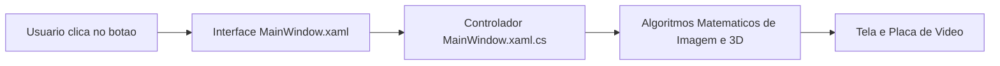

Se você nunca programou em **C#** ou nunca ouviu falar de **.NET** e **WPF**, este capítulo foi escrito para você. Vamos explicar cada conceito usando comparações simples do dia a dia.

---

## 1. O que é uma Linguagem de Programação e o que é o C#?

### A Analogia da Receita de Bolo:
Pense em um computador como um cozinheiro que sabe seguir instruções muito rápido, mas não sabe inventar nada sozinho. Um programa de computador é uma **receita de bolo detalhada**, e o **C#** (pronuncia-se *"C-Sharp"*) é o idioma no qual escrevemos essa receita.

```csharp
// Exemplo de instrucao em C#:
int largura = 512;
string mensagem = "Calculando imagem digital";
Console.WriteLine(mensagem);
```

### Por que usamos C# neste projeto?
Algumas linguagens de programação são fáceis de ler, mas lentas para desenhar jogos e gráficos 3D (como Python). Outras são extremamente rápidas, mas muito difíceis e perigosas de usar (como C++).

Com o **C# moderno (.NET 10)**, temos as duas vantagens:
1. É fácil de ler e organizar;
2. Consegue conversar diretamente com a memória RAM em alta velocidade usando blocos especiais chamados `unsafe` (acesso direto por ponteiros).

---

## 2. O que é a Plataforma .NET?

### A Analogia da Fábrica de Brinquedos:
Se o C# é o idioma da receita, o **.NET** é a **fábrica inteira** equipada com todas as ferramentas necessárias para construir e executar o projeto:

- **CLR (Common Language Runtime):** O gerente da fábrica que lê as instruções do C# e as executa no processador do computador.
- **Garbage Collector (Coletor de Lixo):** Um ajudante automático que limpa da memória do computador as coisas que você não usa mais, evitando que o computador fique lento.
- **Biblioteca Padrão:** Uma caixa de ferramentas gigante já pronta com funções matemáticas (`Math.Sqrt`, `Math.Cos`), listas e controle de múltiplos processadores (`Parallel.For`).

:::tip[O que significa .NET 10?]
O .NET 10 é a versão mais moderna da plataforma, trazendo suporte a instruções matemáticas ultrarrápidas diretamente na CPU do computador.
:::

---

## 3. O que é WPF (Windows Presentation Foundation)?

### A Analogia do Palco de Teatro:
O **WPF** é o sistema que desenha as janelas, botões, barras deslizantes (sliders) e o visor 3D deste projeto na tela do Windows.

Ele funciona separando a aplicação em dois papéis claros:

| Papel | Arquivo | O que faz? | Analogia |
| :--- | :--- | :--- | :--- |
| **Cenário Visual** | `MainWindow.xaml` | Define onde fica cada botão, caixa de texto e janela | O desenho do palco e das luzes |
| **Atores e Lógica** | `MainWindow.xaml.cs` | Executa a matemática quando um botão é clicado | O roteiro do ator quando a cortina abre |



---

## 4. O que é uma Solução (.slnx / .sln) versus um Projeto (.csproj)?

Ao explorar a pasta do código, você verá extensões diferentes:

1. **`CGPDI.StudyLab.slnx` (Solução):**
   - É a pasta-mãe (o fichário principal). Ela reúne todos os projetos que fazem parte do sistema. No Visual Studio, é esse arquivo que você abre com duplo clique.
2. **`CGPDI.StudyLab.csproj` (Projeto C#):**
   - É o manual de instruções de compilação daquele aplicativo específico: quais arquivos compilar, qual versão do .NET utilizar e quais permissões de alta velocidade ativar (como o modo `AllowUnsafeBlocks`).
3. **Arquivos `.cs` (Código-Fonte):**
   - São os arquivos de texto onde estão escritos os algoritmos matemáticos e as funções do sistema.

---

## 5. Resumo Geral

- **C#** é o idioma onde escrevemos a lógica.
- **.NET 10** é o motor que executa o código com alta performance.
- **WPF** é o sistema visual que desenha a interface na tela com aceleração gráfica.
- **DirectBitmap** é o bloco de memória onde calculamos a cor de cada ponto da imagem.

👉 **Próximo Passo:** Aprenda a [Instalar o Visual Studio Passo a Passo](/CGPDI.StudyLab/iniciantes/instalacao-visual-studio/) para rodar o projeto no seu computador.
