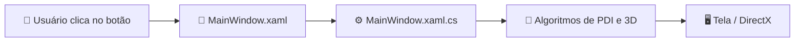

Se você nunca programou em **C#** ou nunca ouviu falar de **.NET** e **WPF**, não se preocupe! Este capítulo foi escrito exatamente para você. Vamos explicar cada conceito com calma e analogias fáceis.

---

## 1. O que é C# (C-Sharp)?

**C#** (pronuncia-se *"C-Sharp"*) é uma linguagem de programação moderna, poderosa e fortemente tipada criada pela Microsoft. Ela combina:
- A facilidade de leitura e produtividade parecida com linguagens como Java, TypeScript e Python;
- A capacidade de controle de baixo nível (ponteiros de memória e alta performance) herdada do **C** e **C++**.

```csharp
// Exemplo simples em C#:
int largura = 512;
string mensagem = "Olá, Computação Gráfica!";
Console.WriteLine($"{mensagem} Imagem de largura {largura}px");
```

### Por que usamos C# neste projeto?
Muitos estudantes acham que para manipular imagens e desenhar gráficos 3D em tempo real é obrigatório usar C++ com OpenGL ou DirectX puro (que são linguagens complexas com gerenciamento manual de ponteiros arriscado). 

Com o **C# moderno (.NET 10)**, conseguimos o **melhor dos dois mundos**:
1. Uma interface gráfica elegante e fácil de construir;
2. Desempenho idêntico ao C++ usando blocos de código especiais chamados `unsafe` (acesso direto a ponteiros de memória RAM).

---

## 2. O que é o .NET (e o .NET 10)?

O **.NET** (ponto-net) não é apenas uma linguagem: ele é a **plataforma (ecossistema de execução)** onde os programas em C# rodam.

Ele é composto por:
- **CLR (Common Language Runtime):** O "motor" que executa o programa, cuida da memória e garante que ele não trave o computador.
- **Garbage Collector (GC):** Um zelador automático na memória RAM que limpa variáveis e objetos que você não usa mais, evitando vazamentos de memória (*memory leaks*).
- **Biblioteca Base (BCA / BCL):** Milhares de funções prontas para matemática (`Math.Sqrt`, `Math.Cos`), coleções (`List<T>`, `Dictionary<K,V>`) e multithreading (`Parallel.For`, `Task`).

:::tip[O que significa .NET 10?]
O .NET 10 é a versão mais moderna da plataforma, lançada com suporte a instruções vetoriais ultra-rápidas da CPU (AVX-512) e otimizações de compilação JIT (*Just-In-Time*).
:::

---

## 3. O que é WPF (Windows Presentation Foundation)?

**WPF** é a tecnologia gráfica que usamos para criar as janelas, botões, sliders, abas e o painel de exibição 3D deste projeto no Windows.

No WPF, o desenvolvimento é separado em duas partes inteligentes:

| Elemento | Onde é escrito? | Função |
| :--- | :--- | :--- |
| **Interface Visual (Telas, Botões, Cores)** | Arquivo `.xaml` (formato XML) | Define a aparência e layout da janela |
| **Lógica e Cálculos (Algoritmos de Imagem e 3D)** | Arquivo `.xaml.cs` (código C#) | Executa a matemática quando você clica em um botão ou arrasta um slider |



---

## 4. O que é uma Solução (`.slnx` / `.sln`) vs Projeto (`.csproj`)?

Ao abrir a pasta do código, você verá arquivos com extensões diferentes. Veja o que cada um significa:

1. **`CGPDI.StudyLab.slnx` (Solução):**
   - É o arquivo "guarda-chuva". Ele organiza todos os projetos que compõem o sistema. Quando você quer abrir o código no Visual Studio, é nele que você clica duas vezes!
2. **`CGPDI.StudyLab.csproj` (Arquivo de Projeto C#):**
   - Descreve como o executável do programa deve ser compilado: qual versão do .NET usar, quais bibliotecas incluir e quais permissões de segurança ativar (como o modo `AllowUnsafeBlocks` para ponteiros de alta velocidade).
3. **Arquivos `.cs` (Código Fonte C#):**
   - São os arquivos de texto contendo os algoritmos matemáticos, classes e funções.

---

## 5. Resumo Rápido

- **C#** é a linguagem onde escrevemos a lógica.
- **.NET 10** é o ambiente que roda nosso código com super velocidade.
- **WPF** é quem desenha a janela moderna e permite aceleração de hardware pela placa de vídeo.
- **DirectBitmap** é o coração deste projeto: um buffer de memória onde alteramos cada pixel na velocidade da luz!

👉 **Próximo Passo:** Aprenda a [Instalar o Visual Studio Passo a Passo](/CGPDI.StudyLab/iniciantes/instalacao-visual-studio/) para rodar o projeto no seu computador!
