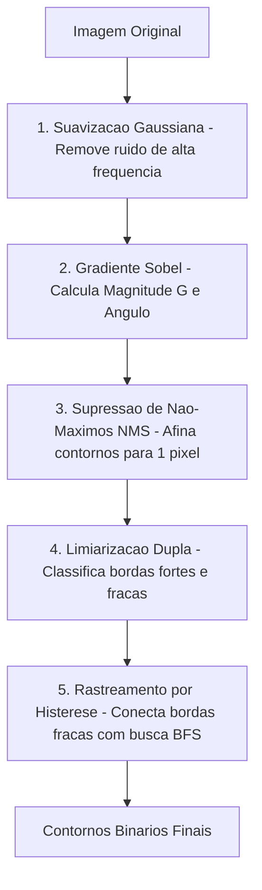

As **Bordas** em uma imagem representam mudanças bruscas de claridade, indicando o contorno de objetos ou limites de superfícies.

---

## 1. Operadores de Gradiente de 1ª Ordem

O gradiente espacial $\nabla f$ calcula a taxa de variação da luminosidade nas direções horizontal ($G_x$) e vertical ($G_y$):

$$
G = \sqrt{G_x^2 + G_y^2}, \quad \theta = \operatorname{atan2}(G_y, G_x)
$$

### Operador Sobel:
$$
K_{x} = \begin{bmatrix} -1 & 0 & 1 \\ -2 & 0 & 2 \\ -1 & 0 & 1 \end{bmatrix}, \quad
K_{y} = \begin{bmatrix} -1 & -2 & -1 \\ 0 & 0 & 0 \\ 1 & 2 & 1 \end{bmatrix}
$$

---

## 2. O Algoritmo de Borda de Canny (5 Etapas)

Criado por John F. Canny em 1986, este método é o padrão da visão computacional para encontrar contornos finos de 1 pixel de espessura sem ruídos falsos.



### Explicação Passo a Passo:

1. **Suavização Gaussiana:** Passa um filtro suave para que pequenas sujeiras não sejam confundidas com contornos.
2. **Cálculo do Gradiente:** Mede a força ($G$) e a inclinação ($\theta$) da borda em cada ponto.
3. **Supressão de Não-Máximos (NMS):** Compara o ponto com seus vizinhos na direção perpendicular ao contorno. Se o ponto não for o pico mais alto, zera o valor. Isso deixa a linha com **exatamente 1 pixel de espessura**.
4. **Limiarização Dupla (Double Threshold):**
   - **Bordas Fortes ($G \ge T_{\text{alto}}$):** Certeza de que é contorno.
   - **Bordas Fracas ($T_{\text{baixo}} \le G < T_{\text{alto}}$):** Candidatas a contorno.
   - **Descarte ($G < T_{\text{baixo}}$):** Ignorado.
5. **Rastreamento por Histerese (Fila BFS):** Percorre todas as bordas fracas. Se uma borda fraca estiver encostada em uma borda forte, ela é mantida; se estiver isolada no vazio, é apagada.

```csharp
// Rastreamento por Histerese em C#:
Queue<int> edgeQueue = new Queue<int>();
while (edgeQueue.Count > 0)
{
    int curr = edgeQueue.Dequeue();
    int cy = curr / width, cx = curr % width;

    for (int k = 0; k < 8; k++)
    {
        int nx = cx + dx[k], ny = cy + dy[k];
        if (nx >= 0 && nx < width && ny >= 0 && ny < height)
        {
            int nIdx = ny * width + nx;
            if (result[nIdx] == WEAK_EDGE)
            {
                result[nIdx] = STRONG_EDGE; // Promove a borda
                edgeQueue.Enqueue(nIdx);    // Propaga a conexao
            }
        }
    }
}
```

---

👉 **Próximo Passo:** Aprenda sobre [Morfologia Matemática e Limiarização de Otsu](/pdi/morfologia-matematica-e-otsu/).
