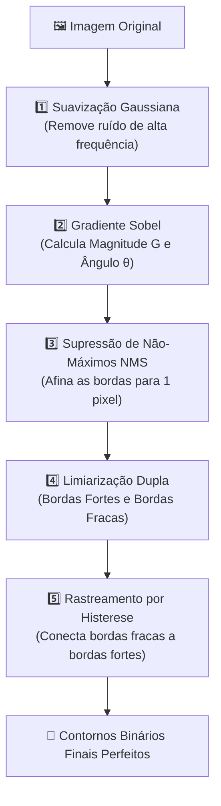

As **Bordas** em uma imagem representam descontinuidades abruptas na intensidade luminosa dos pixels, correspondendo a limites de objetos, mudanças de materiais ou sombras de geometria.

---

## 📈 1. A Matemática das Derivadas Espaciais

Na matemática contínua, a taxa de variação espacial de uma função bidimensional $f(x, y)$ é dada pelo vetor **Gradiente $\nabla f$**:

$$
\nabla f = \begin{bmatrix} G_x \\ G_y \end{bmatrix} = \begin{bmatrix} \frac{\partial f}{\partial x} \\ \frac{\partial f}{\partial y} \end{bmatrix}
$$

A **Magnitude do Gradiente** (força da borda):
$$
G = \|\nabla f\| = \sqrt{G_x^2 + G_y^2} \quad \approx |G_x| + |G_y|
$$

A **Direção Angular do Gradiente** (ângulo ortogonal à borda):
$$
\theta = \operatorname{atan2}(G_y, G_x)
$$

---

## 🔍 2. Operadores de Gradiente de 1ª Ordem

### 1. Operador Sobel (Padrão da Indústria)
Combina diferenciação com suavização Gaussiana na direção ortogonal:

$$
K_{x} = \begin{bmatrix} -1 & 0 & 1 \\ -2 & 0 & 2 \\ -1 & 0 & 1 \end{bmatrix}, \quad
K_{y} = \begin{bmatrix} -1 & -2 & -1 \\ 0 & 0 & 0 \\ 1 & 2 & 1 \end{bmatrix}
$$

### 2. Operador Prewitt
Similar ao Sobel, mas com pesos uniformes:

$$
K_{x} = \begin{bmatrix} -1 & 0 & 1 \\ -1 & 0 & 1 \\ -1 & 0 & 1 \end{bmatrix}, \quad
K_{y} = \begin{bmatrix} -1 & -1 & -1 \\ 0 & 0 & 0 \\ 1 & 1 & 1 \end{bmatrix}
$$

### 3. Operador Scharr (Maior Simetria Rotacional)
Otimizado para minimizar erros angulares em diagonais:

$$
K_{x} = \begin{bmatrix} -3 & 0 & 3 \\ -10 & 0 & 10 \\ -3 & 0 & 3 \end{bmatrix}, \quad
K_{y} = \begin{bmatrix} -3 & -10 & -3 \\ 0 & 0 & 0 \\ 3 & 10 & 3 \end{bmatrix}
$$

---

## ⭕ 3. Operador Laplaciano (2ª Derivada Espacial)

O Laplaciano $\nabla^2 f$ calcula a soma das segundas derivadas parciais, sendo um operador isotrópico (independente da direção):

$$
\nabla^2 f = \frac{\partial^2 f}{\partial x^2} + \frac{\partial^2 f}{\partial y^2}
$$

### Kernel Discreto Laplaciano (8-vizinhança):
$$
K_{\text{lap}} = \begin{bmatrix} -1 & -1 & -1 \\ -1 & 8 & -1 \\ -1 & -1 & -1 \end{bmatrix}
$$

- Onde o gradiente de 1ª ordem atinge um pico (máximo local), o Laplaciano cruza o valor zero (*Zero-Crossing*).

---

## 🏆 4. O Algoritmo de Borda de Canny (Padrão-Ouro em 5 Etapas)

Criado por John F. Canny em 1986, este algoritmo foi matematicamente demonstrado como o detector de bordas ótimo sob três critérios: **baixa taxa de erro**, **localização precisa** e **resposta única** (bordas com 1 pixel de espessura).



### Detalhamento das 5 Etapas no Código (`SpatialFilters.cs`):

#### Etapa 1: Suavização Gaussiana
Aplica um filtro Gaussiano $5 \times 5$ para eliminar ruídos aleatórios que seriam incorretamente interpretados como bordas.

#### Etapa 2: Cálculo de Magnitude e Ângulo
Calcula $G = \sqrt{G_x^2 + G_y^2}$ e $\theta = \operatorname{atan2}(G_y, G_x)$.

#### Etapa 3: Supressão de Não-Máximos (NMS)
Quantiza a direção $\theta$ em 4 setores angulares fundamentais ($0^\circ, 45^\circ, 90^\circ, 135^\circ$). Compara a magnitude do pixel central com seus dois vizinhos imediatos ao longo da reta perpendicular à borda:
- Se o pixel for menor que qualquer um dos dois vizinhos, ele é **suprimido para zero**.
- Se for o pico local, é mantido. Isso reduz a espessura das bordas para exatamente **1 pixel**.

#### Etapa 4: Limiarização Dupla (Double Thresholding)
Divide os pixels restantes em 3 categorias baseadas em dois limiares $T_{\text{baixo}}$ e $T_{\text{alto}}$:
- **Borda Forte:** $G(x, y) \ge T_{\text{alto}}$ (certeza absoluta de borda).
- **Borda Fraca:** $T_{\text{baixo}} \le G(x, y) < T_{\text{alto}}$ (candidata a borda).
- **Não-Borda:** $G(x, y) < T_{\text{baixo}}$ (descartado).

#### Etapa 5: Rastreamento de Bordas por Histerese (Queue / BFS)
Utiliza uma busca em largura (*Breadth-First Search*) com fila: todas as bordas fortes são colocadas na fila inicial. Quando desenrolamos a fila, qualquer borda fraca conectada na 8-vizinhança a uma borda forte é promovida a borda forte. Bordas fracas isoladas no meio do nada são descartadas!

```csharp
// Implementação em C# com Fila BFS:
Queue<int> edgeQueue = new Queue<int>();
// Enfileira todos os pixels com borda forte...
while (edgeQueue.Count > 0)
{
    int curr = edgeQueue.Dequeue();
    int cy = curr / width, cx = curr % width;

    for (int k = 0; k < 8; k++)
    {
        int nx = cx + dx[k], ny = cy + dy[k];
        if (nx >= 0 && nx < width && ny >= 0 && ny < height)
        {
            int nIdx = ny * width + nx;
            if (result[nIdx] == WEAK_EDGE)
            {
                result[nIdx] = STRONG_EDGE; // Promove
                edgeQueue.Enqueue(nIdx);    // Propaga
            }
        }
    }
}
```

---

👉 **Próximo Passo:** Aprenda sobre [Morfologia Matemática e Limiarização de Otsu](/CGPDI.StudyLab/pdi/morfologia-matematica-e-otsu/).
