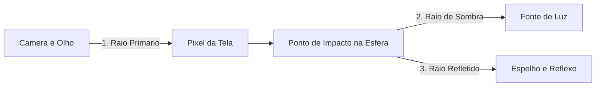

O **Ray Tracing (Traçado de Raios)** é o método de renderização que simula com maior fidelidade o comportamento físico da luz no mundo real.

O arquivo [`Raytracer3D.cs`](https://github.com/Gabriel-Freitas-S/CGPDI.StudyLab/blob/main/CGPDI.StudyLab/Graphics3D/Raytracer3D.cs) implementa um **Whitted Ray Tracer** recursivo.

---

## 1. Por que Traçamos Raios "da Câmera para o Mundo"?

### A Analogia do Laser Invisível:
Na vida real, uma lâmpada emite bilhões de raios de luz em todas as direções, mas quase todos se perdem e não chegam nos seus olhos.

Se o computador simulasse a luz saindo da lâmpada, passaria 99.9% do tempo calculando raios invisíveis. Por isso, o Ray Tracer faz o caminho inverso: **dispara uma linha de visão reta a partir do olho do observador através de cada pixel da tela**:

---

## 2. A Equação Paramétrica do Raio 3D

Um raio é uma semirreta definida por uma **Origem $\vec{O}$** e uma **Direção unitária $\vec{D}$**:

$$
\vec{r}(t) = \vec{O} + t \cdot \vec{D}, \quad t > 0
$$

---

## 3. Raios de Sombra (Shadow Rays)

Para saber se um ponto na superfície de uma esfera está iluminado ou na sombra:
1. Disparamos um raio do ponto de impacto em direção à lâmpada.
2. Se houver algum objeto no meio do caminho, o ponto está na sombra.
3. Se o caminho estiver livre, somamos a luz direta.

---

## 4. O Modelo de Iluminação de Phong

$$
I_{\text{total}} = \underbrace{I_a k_a}_{\text{Luz Ambiente}} + \underbrace{I_d k_d (\vec{N} \cdot \vec{L})}_{\text{Reflexão Difusa}} + \underbrace{I_s k_s (\vec{R} \cdot \vec{V})^\alpha}_{\text{Brilho Especular}}
$$

---

👉 **Próximo Passo:** Veja como calcular analiticamente a [Interseção Raio-Esfera e Raio-Plano](/CGPDI.StudyLab/raytracing/intersecao-e-geometria/).
