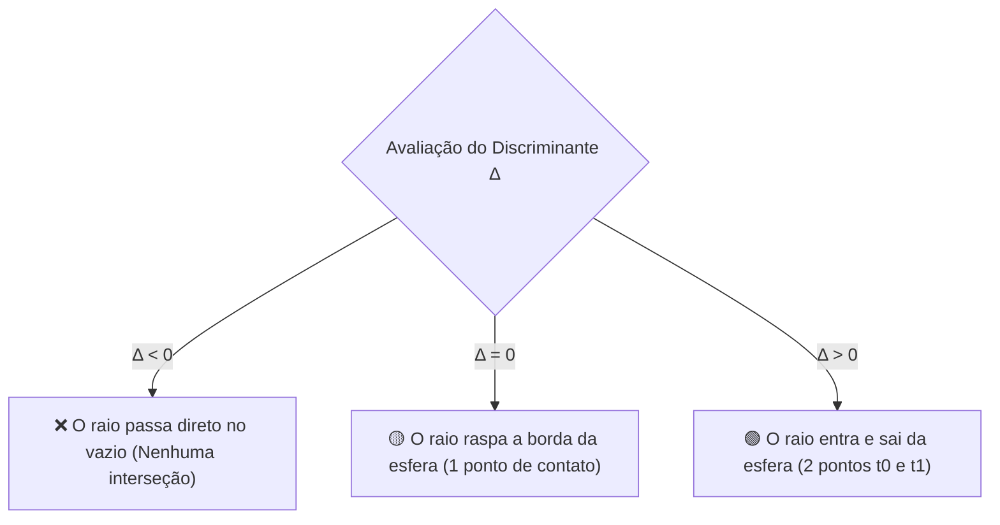

O núcleo de desempenho de um Ray Tracer reside na velocidade com que ele consegue calcular o ponto de interseção entre um raio $\vec{r}(t) = \vec{O} + t\vec{D}$ e os objetos da cena.

O arquivo [`Raytracer3D.cs`](https://github.com/Gabriel-Freitas-S/CGPDI.StudyLab/blob/main/CGPDI.StudyLab/Graphics3D/Raytracer3D.cs) resolve essas equações de forma 100% analítica.

---

## ⚽ 1. Dedução Matemática da Interseção Raio-Esfera

Uma esfera 3D é definida por seu **Centro $\vec{C} = (C_x, C_y, C_z)$** e seu **Raio $R$**:

$$
\|\vec{P} - \vec{C}\|^2 = R^2 \implies (\vec{P} - \vec{C}) \cdot (\vec{P} - \vec{C}) = R^2
$$

Substituindo a equação do raio $\vec{P} = \vec{O} + t\vec{D}$:

$$
(\vec{O} + t\vec{D} - \vec{C}) \cdot (\vec{O} + t\vec{D} - \vec{C}) = R^2
$$

Seja $\vec{V} = \vec{O} - \vec{C}$ o vetor da origem da esfera até a origem do raio:

$$
(t\vec{D} + \vec{V}) \cdot (t\vec{D} + \vec{V}) = R^2
$$

Expandindo o produto escalar:
$$
(\vec{D} \cdot \vec{D}) t^2 + 2(\vec{D} \cdot \vec{V}) t + (\vec{V} \cdot \vec{V} - R^2) = 0
$$

Essa é uma equação clássica do segundo grau ($a t^2 + b t + c = 0$):

- $a = \vec{D} \cdot \vec{D} = 1.0$ (já que o vetor direção $\vec{D}$ é normalizado)
- $b = 2 (\vec{D} \cdot \vec{V})$
- $c = (\vec{V} \cdot \vec{V}) - R^2$

### O Discriminante ($\Delta = b^2 - 4ac$):
$$
\Delta = b^2 - 4ac
$$



```csharp
// Implementação em C# no Raytracer3D.cs:
public override bool Intersect(Ray3D ray, out double t, out Vec3 normal)
{
    t = 0; normal = Vec3.Zero;
    Vec3 oc = ray.Origin - Center;
    double b = Vec3.Dot(oc, ray.Direction);
    double c = Vec3.Dot(oc, oc) - Radius * Radius;
    double discriminant = b * b - c;

    if (discriminant < 0) return false;

    double sqrtDisc = Math.Sqrt(discriminant);
    double t0 = -b - sqrtDisc;
    double t1 = -b + sqrtDisc;

    if (t0 > 1e-4)      t = t0; // Primeiro ponto de contato mais próximo
    else if (t1 > 1e-4) t = t1; // Câmera está dentro da esfera
    else return false;

    Vec3 hitPoint = ray.Origin + ray.Direction * t;
    normal = (hitPoint - Center).Normalized; // Normal unitária na esfera
    return true;
}
```

---

## 🏁 2. Interseção Raio-Plano (Chão Xadrez)

Um plano infinito horizontal com altura $Y = y_{\text{chão}}$ e normal $\vec{N} = (0, 1, 0)$:

O ponto de impacto ocorre em:
$$
t = \frac{y_{\text{chão}} - O_y}{D_y}
$$

### Padrão Procedural de Xadrez:
Para saber a cor no chão $(P_x, P_z)$:
```csharp
int squareSize = 2;
bool isEven = (((int)Math.Floor(hitPoint.X / squareSize) + 
                (int)Math.Floor(hitPoint.Z / squareSize)) % 2) == 0;
Vec3 color = isEven ? new Vec3(0.9, 0.9, 0.9) : new Vec3(0.2, 0.2, 0.2);
```

---

👉 **Próximo Passo:** Aprenda sobre [Reflexões Especulares & Refração de Snell](/CGPDI.StudyLab/raytracing/reflexao-refracao-snell/).
