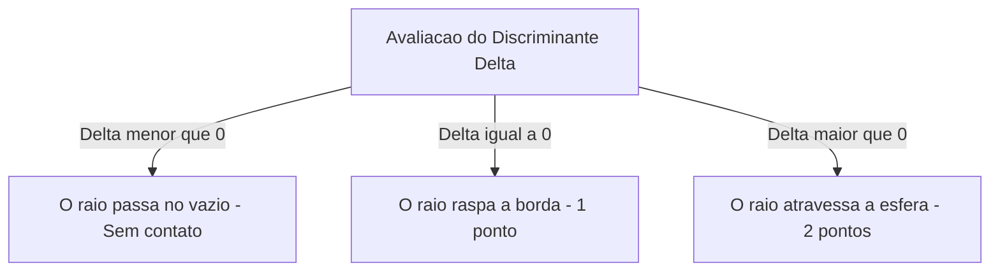

O arquivo [`Raytracer3D.cs`](https://github.com/Gabriel-Freitas-S/CGPDI.StudyLab/blob/main/CGPDI.StudyLab/Graphics3D/Raytracer3D.cs) calcula analiticamente as colisões de raios contra superfícies geométricas.

---

## 1. Interseção Raio-Esfera (Equação Quadrática)

A esfera possui centro $\vec{C}$ e raio $R$. Ao substituir o raio $\vec{r}(t) = \vec{O} + t\vec{D}$, obtemos a equação de 2º grau:

$$
a t^2 + b t + c = 0
$$

- $a = \vec{D} \cdot \vec{D} = 1.0$
- $b = 2(\vec{D} \cdot (\vec{O} - \vec{C}))$
- $c = \|\vec{O} - \vec{C}\|^2 - R^2$

### O Discriminante ($\Delta = b^2 - 4ac$):



```csharp
// Intersecao Raio-Esfera em C#:
public override bool Intersect(Ray3D ray, out double t, out Vec3 normal)
{
    t = 0; normal = Vec3.Zero;
    Vec3 oc = ray.Origin - Center;
    double b = Vec3.Dot(oc, ray.Direction);
    double c = Vec3.Dot(oc, oc) - Radius * Radius;
    double discriminant = b * b - c;

    if (discriminant < 0) return false;

    double sqrtDisc = Math.Sqrt(discriminant);
    double t0 = -b - sqrtDisc;
    double t1 = -b + sqrtDisc;

    if (t0 > 1e-4)      t = t0;
    else if (t1 > 1e-4) t = t1;
    else return false;

    Vec3 hitPoint = ray.Origin + ray.Direction * t;
    normal = (hitPoint - Center).Normalized;
    return true;
}
```

---

## 2. Interseção Raio-Plano (Chão Xadrez)

O ponto de impacto em um plano horizontal $Y = y_{\text{chão}}$:

$$
t = \frac{y_{\text{chão}} - O_y}{D_y}
$$

---

👉 **Próximo Passo:** Aprenda sobre [Reflexões Especulares & Refração de Snell](/raytracing/reflexao-refracao-snell/).
