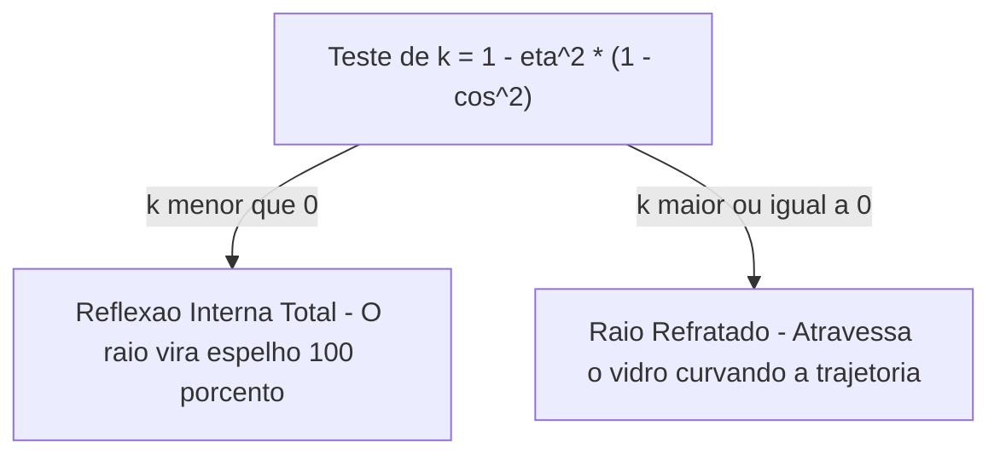

O arquivo [`Raytracer3D.cs`](https://github.com/Gabriel-Freitas-S/CGPDI.StudyLab/blob/main/CGPDI.StudyLab/Graphics3D/Raytracer3D.cs) simula espelhos, metais cromados e esferas de vidro transparente por meio de **Recursão de Raios**.

---

## 1. A Lei da Reflexão Especular

Para superfícies refletivas (espelhos), o raio refletido $\vec{R}$ a partir da direção do raio incidente $\vec{D}$ e da normal $\vec{N}$ é dado por:

$$
\vec{R} = \vec{D} - 2(\vec{D} \cdot \vec{N}) \vec{N}
$$

---

## 2. A Lei de Refração de Snell (Vidro e Água)

Quando a luz passa do ar ($\eta_1 \approx 1.0$) para o vidro ($\eta_2 \approx 1.5$), sua trajetória se curva:

$$
\eta_1 \sin\theta_1 = \eta_2 \sin\theta_2
$$

---

## 3. O Efeito de Fresnel (Aproximação de Schlick)

Calcula a proporção exata de luz que deve ser **refletida** versus a proporção que deve ser **refratada** dependendo do ângulo de visão do observador:

$$
R_0 = \left( \frac{\eta_1 - \eta_2}{\eta_1 + \eta_2} \right)^2, \quad R(\theta) = R_0 + (1 - R_0)(1 - \cos\theta)^5
$$

---

👉 **Próximo Passo:** Consulte o [Mapeamento do Plano de Ensino da Disciplina](/academico/mapeamento-do-plano/).
