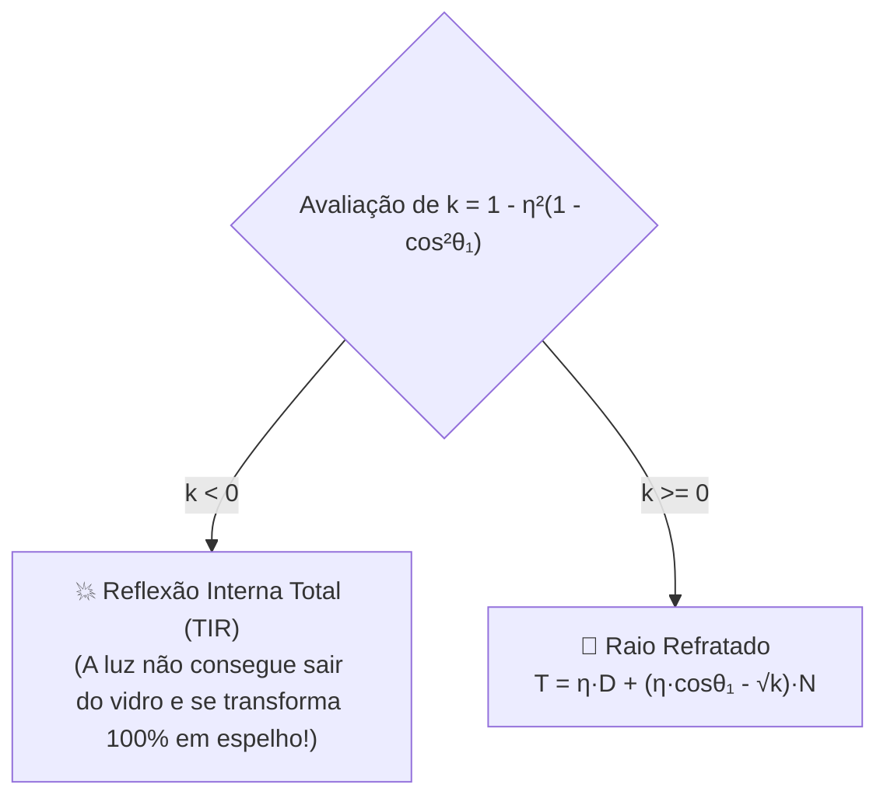

O que torna o Ray Tracing verdadeiramente espetacular é sua capacidade de simular espelhos perfeitos, metais cromados e esferas de vidro transparente de forma natural através da **Recursão de Raios**.

O arquivo [`Raytracer3D.cs`](https://github.com/Gabriel-Freitas-S/CGPDI.StudyLab/blob/main/CGPDI.StudyLab/Graphics3D/Raytracer3D.cs) calcula reflexões e refrações físicas até uma profundidade máxima de rebatimento (*Max Depth*).

---

## 🪞 1. A Lei da Reflexão Especular

Quando a luz atinge uma superfície lisa e polida (como um espelho), o ângulo de incidência é exatamente igual ao ângulo de reflexão.

O vetor de direção refletida $\vec{R}$ a partir da direção do raio incidente $\vec{D}$ e da normal $\vec{N}$ é dado por:

$$
\vec{R} = \vec{D} - 2(\vec{D} \cdot \vec{N}) \vec{N}
$$

```csharp
// Função de Reflexão no Math3D.cs:
public static Vec3 Reflect(Vec3 d, Vec3 n)
{
    return d - n * (2.0 * Vec3.Dot(d, n));
}
```

---

## 🥃 2. A Lei de Refração de Snell (Vidro e Água)

Quando um raio de luz passa de um meio transparente para outro com densidade ótica diferente (por exemplo, do **Ar** com índice de refração $\eta_1 \approx 1.0$ para o **Vidro** com $\eta_2 \approx 1.5$), sua velocidade muda e a trajetória da luz **se curva**:

$$
\eta_1 \sin\theta_1 = \eta_2 \sin\theta_2
$$

### Índice de Refração Relativo ($\eta = \frac{\eta_1}{\eta_2}$):
O vetor de direção refratada $\vec{T}$ é calculado por:

$$
\cos\theta_1 = -\vec{D} \cdot \vec{N}
$$
$$
k = 1.0 - \eta^2 (1.0 - \cos^2\theta_1)
$$



```csharp
// Refração de Snell em C#:
public static bool Refract(Vec3 d, Vec3 n, double eta, out Vec3 refracted)
{
    double cosTheta = -Vec3.Dot(d, n);
    double k = 1.0 - eta * eta * (1.0 - cosTheta * cosTheta);

    if (k < 0)
    {
        refracted = Vec3.Zero;
        return false; // Reflexão Interna Total (TIR)
    }

    refracted = (d * eta + n * (eta * cosTheta - Math.Sqrt(k))).Normalized;
    return true;
}
```

---

## 💎 3. O Efeito de Fresnel (Aproximação de Schlick)

Você já reparou que ao olhar para um lago bem de cima a água parece transparente, mas ao olhar deitada no horizonte a água se torna um espelho refletivo?

Isso é explicado pelas **Equações de Fresnel**, aproximadas pela fórmula de **Christophe Schlick**:

$$
R_0 = \left( \frac{\eta_1 - \eta_2}{\eta_1 + \eta_2} \right)^2
$$
$$
R(\theta) = R_0 + (1 - R_0)(1 - \cos\theta)^5
$$

- $R(\theta)$ nos dá a porcentagem exata de luz que deve ser **refletida** versus a porcentagem que deve ser **refratada** para gerar renderizações de vidro com realismo fotográfico!

---

👉 **Próximo Passo:** Consulte o [Mapeamento do Plano de Ensino da Disciplina](/CGPDI.StudyLab/academico/mapeamento-do-plano/).
