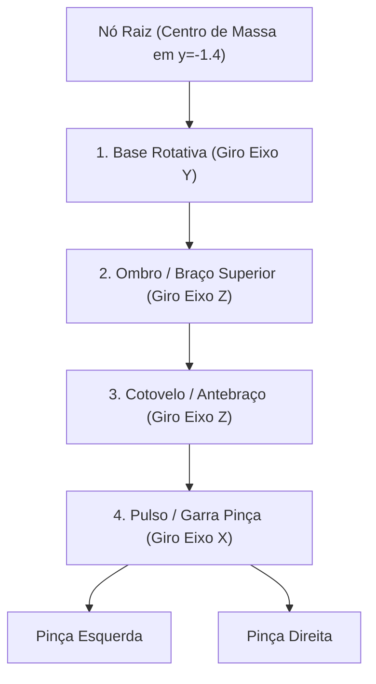

# 🤖 Capítulo 5: Modelagem Hierárquica & Cinemática Direta

Implementado no módulo [`Graphics3D/HierarchicalModeling.cs`](file:///D:/source/repos/teste/teste/Graphics3D/HierarchicalModeling.cs).

---

## 1. Motivação da Modelagem Hierárquica & Grafos de Cena (Scene Graph)

Na computação gráfica do mundo real, a maioria dos objetos não são blocos estáticos isolados, mas **sistemas compostos por múltiplas partes articuladas** (robôs, veículos com rodas, esqueletos de personagens, guindastes e sistemas planetários).

Em vez de recalcular manualmente a posição espacial absoluta de cada dedo ou engrenagem a cada quadro, organiza-se a cena em uma **Árvore de Nós Hierárquica (Grafo de Cena)**:

---

## 2. Propagação Matricial Pai $\to$ Filho

Cada nó possui sua matriz de transformação local $M_{\text{local}}$ (suas próprias translações e rotações em torno de sua junta).
A matriz de transformação de mundo acumulada de um nó filho é dada pelo produto da matriz do pai pela sua matriz local:

$$M_{\text{global, filho}} = M_{\text{global, pai}} \times M_{\text{local, filho}}$$

### Cinemática Direta (Forward Kinematics - FK)
Para determinar a posição final da garra do robô:

$$M_{\text{garra}} = T_{\text{raiz}} \times R_y(\theta_{\text{base}}) \times T_{\text{ombro}} \times R_z(\theta_{\text{ombro}}) \times T_{\text{cotovelo}} \times R_z(\theta_{\text{cotovelo}}) \times T_{\text{pulso}} \times R_x(\theta_{\text{pulso}})$$

* Ao rotacionar a **Base**, o ombro, braço, cotovelo, antebraço e garras giram em conjunto automaticamente.
* Ao articular o **Cotovelo**, apenas o antebraço e a garra se movem, mantendo a base e o braço superior intactos.

---

## 3. Design Top-Down e Construção Bottom-Up

* **Design Top-Down:** A arquitetura do robô e os limites angulares de cada articulação são planejados a partir do objetivo do sistema.
* **Construção Bottom-Up:** As primitivas geométricas básicas (cilindros, caixas, pinças) são instanciadas isoladamente com coordenadas centradas e em seguida agrupadas na árvore hierárquica usando `Model3DGroup` e `Transform3DGroup` do WPF.

---

## 4. Animação Contínua e Interação

No código do [`MainWindow.xaml.cs`](file:///D:/source/repos/teste/teste/MainWindow.xaml.cs), a animação do robô utiliza um `DispatcherTimer` de alta resolução sincronizado com funções trigonométricas harmônicas em tempo real:

$$\theta_{\text{base}}(t) = 90^\circ \cdot \sin(0.7 t)$$
$$\theta_{\text{ombro}}(t) = 40^\circ \cdot \sin(1.1 t) + 15^\circ$$
$$\theta_{\text{cotovelo}}(t) = 50^\circ \cdot \cos(1.3 t) - 20^\circ$$
$$\theta_{\text{pulso}}(t) = 60^\circ \cdot \sin(2.0 t)$$
